# **2. Robot Movement**

## **Overview**
In this chapter, we will learn everything needed to make the robot move around, from the fundamentals of the robot’s positionings, the parameters, and different representations describing the robot's position, to the details of the robot's motions. Meanwhile, we will overview the basic geometrical and mathematical needed to deepen our understanding of this subject.

---
## **Basics of Robots Positioning**
The ultimate goal of working with robots in general or more specifically, industrial robots, is to move the objects or tools in the environment in a planned and deterministic manner in response to the observed state of the world. The input comes from the sensors for the cameras, it will get processed in a processing unit, and the result or output is always a series of motion commands for the robot that results in a desired outcome. To plan and design a proper motion for the robot, we have to know its specific movement capabilities, what the controllable parameters of the robots are, and how changing these parameters results in a motion in 3-dimensional space. 

Most of the time, the source of motion in all sorts of rigid robotic systems is the rotatory motors that control the rotations of joints or rails. The robot's controller is in charge of translating and communicating the operator’s command to signals for the motors. The controller demands you, to give the desired angles of the joints, then it communicates with the motors so that the robot goes in your desired orientation. 

Specifying the robot’s joints to achieve a desired orientation is not the only possible way to set its state, but it’s usually the most basic and easy way. So first we have to study our robot's joint values and geometric setup.

### **Basics of Robots Positioning**

Dorna TA is a 6-axis robotic arm, meaning that counting from the robot’s base up to the end effector (the connected tool at the end of the robot) there are a total of 6 motors each of which rotates one of the 6 joints of the robots (excluding rail or the end effector’s motion actuators). This high number of degrees of control results in a wide range of possible motions and poses of the robotic arm. 

Each joint value is defined as the amount of rotation needed ( in the degrees unit) to transform that joint from a (previously defined) zero-value state to the current state. We call these values J0, J1, J2, J3, J4, J5 for each joint respectively, and we combine all of them inside a vector to represent the robot state as ```(J0, J1, J2, J3, J4, J5)```.


The Joint values: J0, J1,... are all measured in the units of degrees, usually bounded in the range ```(-180°,180°)```. 

|  | 
|:--:| 
| *Joint values on a unit circle, note that there is an ambiguity where 180° aligns with -180°, but usually in the cases we are dealing with this value for joints is inaccessible from both directions* |


The zero state in which all the joint values are zero, ```(0, 0, 0, 0, 0, 0)``` can be seen below for the Dorna TA:

| 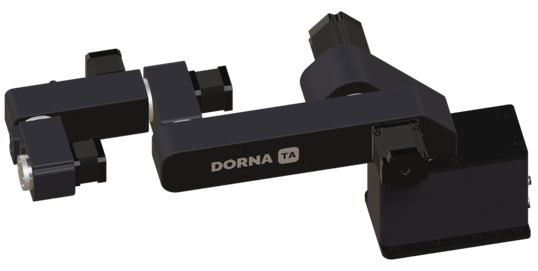 | 
|:--:| 
| *The zero state or ```(0, 0, 0, 0, 0, 0)``` of the Dorna TA 6-axis robotic arm* |

Now, in the images below you can find out what it looks like if each of the joints is increased (or decreased) independently:

|  | 
|:--:| 
| *J0 rotation* |

| 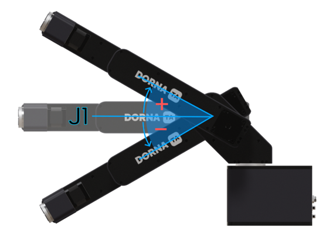 | 
|:--:| 
| *J1 rotation* |

| 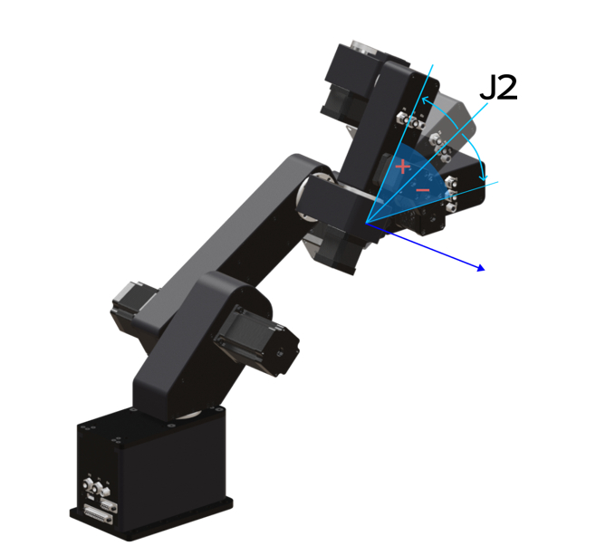 | 
|:--:| 
| *J2 rotation* |

| 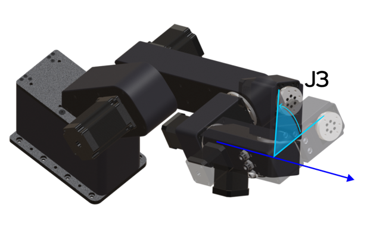 | 
|:--:| 
| *J3 rotation* |

| 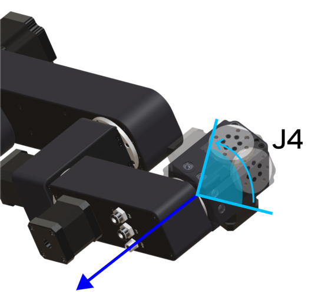 | 
|:--:| 
| *J4 rotation* |

| 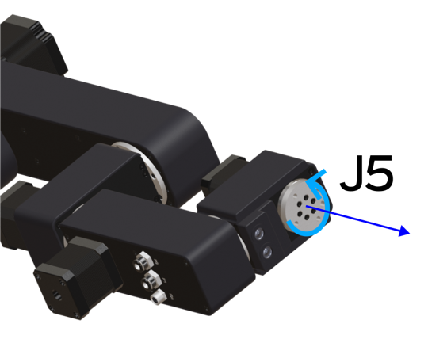 | 
|:--:| 
| *J5 rotation* |

As you can see above rotating the first joints has a much greater impact on the  robot’s overall orientation and position, the effect decreases for the next joints. 

### **Dorna Robot's Posing**
Now it’s time to test the theories you’ve learned by now on the robots present at your lab. To do so, you should start by turning the robot on and connecting it to the computer with the help of your instructor and referring to the robot’s user manual.

Connecting the controller to the computer lets you use the Dorna Lab and Dorna API to observe the robot's state and control/program the robot by sending all kinds of commands to it.

| 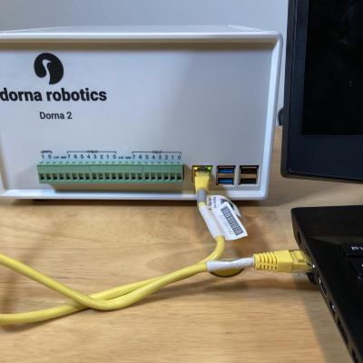 | 
|:--:| 
| *Connecting robot to the computer via Ethernet cable* |

After opening "Dorna Lab" on the computer’s browser, you’ll be able to see a live 3D model of the robot on the screen and lots of options for interacting with it.

| 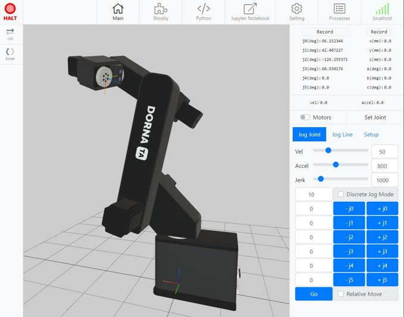 | 
|:--:| 
| *Dorna Lab's first look* |

One needs to have access to the precise values of the current joint values of the robot to be able to work with it. For this goal, you can refer to the real-time joint values on the right panel. There you can also observe the robot’s Cartesian position which you’ll learn about later.

| 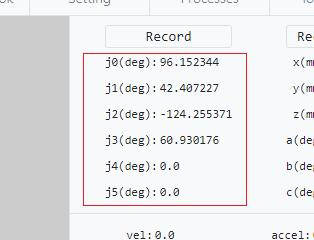 | 
|:--:| 
| *Real-time joint values of the robot* |

On the other hand, you’ll need to change the robot’s joint values or “pose”. Dorna lab gives you different options for changing the robot's pose, here we will learn about some of the most important ones.

#### ✋**Posing by Hand**
Turn the motors off, using the “Motors” button in the right panel. This will turn off the magnetic force of all the robot's motors that hold each joint in position. Now since there is no blocking torque in the motors, it becomes reactive to any external force acting on it (keep in mind that gravity is always hard at work!) You’ll be able to move around the robot freely by hand, afterward, turning the motors on again will fix the robot in the new position. You may need a friend’s hand to turn the motors on/off while you’re holding the robot in your desired position. This procedure may also be called, hand training the robot. 

| 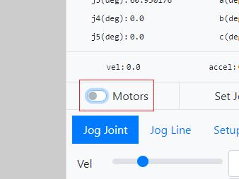 | 
|:--:| 
| *The "Motors" button is used to turn the motors on/off* |

#### 🏃‍♀️**Posing by Jogging**
This option helps you move the robot incrementally over time, this helps you to find the proper position using trial and error. 

| 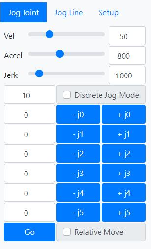 | 
|:--:| 
| *The "Jog" buttons for each joint, in the plus/minus direction* |

Until you hold onto these buttons, for example, the +j3 (-j3) button, the j3 value keeps increasing (decreasing). When you let go of the jog button the motion will immediately stop. There is also an option for you to perform these increments in discrete steps. You can do this by enabling the “Discrete Jog Mode” check box above the jog buttons and setting the “Discrete step size” value on the left of that checkbox. Now whenever you click on any of the jog buttons, e.g. j3, the value of j3 will increase by the amount of the step size (e.g. in the picture above, the step size is 10 degrees) and it won’t stop even if you release the key. Using “Discrete Jog”  helps you move the robot more carefully and with more control, it’s very useful, especially for tight spaces and delicate situations.

Posing the robot with the jog buttons proves to be very useful, but it may be hard for the user to control the jog buttons by clicking. There is also the option to perform all the possible jogs, using a keyboard/joystick. This resembles controlling the robot like controlling a character in a video game. In order to be able to do this, you have to change some settings. Start by clicking on the “Setup” section above the jog buttons.

| 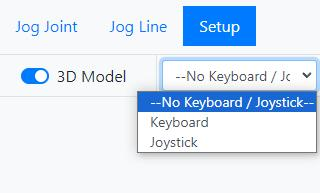 | 
|:--:| 
| *Enabling keyboard/Joystick control* |

There you have a dropdown that gives you three options. The default option is not to use a keyboard or joystick. Select any of the other two options based on you’re desired input.

The next step is to customize your input map, there you can indicate that each input button controls which jog button.
Head to the settings tab:


And find the keyboard joystick settings subsection

| 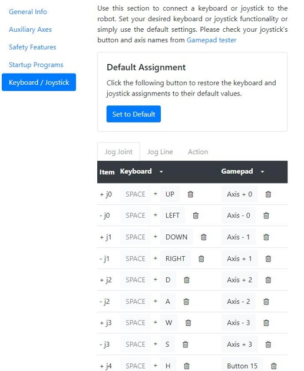 | 
|:--:| 
| *Input map setting* |

If you’re using a gamepad/joystick, use the link there to test your input device. Next, you’ll find options to set your input map. Note that there are three categories: Jog joint, Jog Line, and Action. The first two are for setting keys for jog motions and the last one is for setting keys for other usual jobs like turning motors on/off and halting the motion. For each act, you can set a keyboard key and a gamepad key. Click on the default values to change the keys. Or click on the “trash” button to clear the values. Also, note that all the keyboard buttons have to be a “space” + your "key" of choice. This is because we do not want to move the robot unintentionally when using the keyboard for other purposes.

After setting your values, for example for the “Jog Joint” buttons, head back to the jog section, click on the Jog Joint tab (it won’t work if you are not in that tab), and use your input to test the robot jogging. 

#### 📜**Posing By Commands**
The final and most important method is to send a motion command for the robot and expect the robot to get into our desired configuration when the motion has ended. Here’s how you can do this. 
| 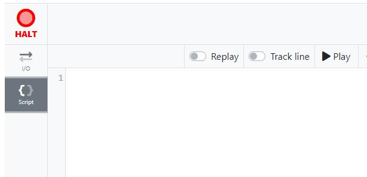 | 
|:--:| 
| *Use the sidebar option “Script” to open the script panel* |

Open the script panel. We can type one or multiple commands for the robot, in the text box appearing, and after pressing the ▷Play button, all those commands will get committed and immediately executed one by one by the robot. Here we will talk about motion commands. A motion command looks like this:

```JSON
{"cmd":"jmove", "j0":3.4, "j1":1.2, "j2":97.3, "j3":22, "j4": 32.76, "j5":0, "vel":120.43, "accel": 804.11} 
```

All commands contain some keys, that are all enclosed between quotation marks (“”). Each key is assigned a value, the value can be a number, or in some cases a string. Assigning ```“jmove”``` to the key ```“cmd”``` means that we are asking the robot to perform a motion command and all that comes after it are the parameters describing that motion command. The joint values that are assigned afterward, are the joint values we are asking the robot to move to.

<div style="border: 1px solid black; padding: 10px; background-color: #c8e3c3;">
<h3 style="margin-top: 0;">Lab Exercise 1</h3>
 Consider the robot state is J1= 50°. What should the value of J2 be, for the third arm to be parallel to the ground? How many answers are there to this question? 
Try this on the robot, test with different values of J1 and J2.

Use any methods introduced above to set the pose of the robot for approaching this problem. Guess what the answer could be, then test your answers by posing the robot.
</div>

### **Joint Limits**
in every robotic system, there is no total freedom in the rotation of each joint. There are different possible limitations causes for joint movements:


- **Joints internal limits**: Each joint has an internal limit forcing it to rotate around only between a lower bound and an upper bound, this limitation is caused by the robot’s internal structure. For example, the J0 value has to only be in the range ```(-180, 180)```. There is like an invisible wall between the values -180, and +180. If you need to rotate J0 from -170 to 170 you have to take the long way that passes from 0. The last joint, if no tools with connected wire are attached to it, is the only joint with no limitation, no structure holds it from rotating multiple rounds.

- **Robot self-collision**: In some cases, the robot’s arms may collide with each other or other parts of the robot’s body. This kind of limitation should also be taken care of when we are planning the motions. Avoiding a robot self-collision can be counted as one of the safety precautions discussed in the first chapter.


- **External limitations**: This limitation exists because of the environment and object placements in the robot’s working place. For example, a rigid wall may be behind the robot so you don’t want the robot J0 to go past the ```(-90, 90)``` range. These special limitations should be taken care of by the user for their specific case.

### **Spatial (Cartesian) Representation**
Using the 6 joint values to represent the state of the robot is the most exact and straightforward possible way. As long as you smoothly change the joint values, the robot also responds smoothly. You exactly know which joints are going to change in each motion command, and how much each.

But in many real-world scenarios, it is hard to translate this 6-valued vector J, to parameters you need to quantify the desired robot motion.

For example when the robot detects an object using a camera and we want the robot to go and grab that object in the detected spatial position, what values of joints does the work for us? To be able to work more easily in real-world scenarios, we should be able to also use 3D coordinates of the end effector of the robot.

As we are used to depicting 3d space by drawing a 3-axis coordinate frame, we can do the same for the space of all possible joint values, a 6-dimensional world with coordinates J0-J1-J2-... instead of x,y,z. In both of these spaces, each point represents the state of the robot.

| 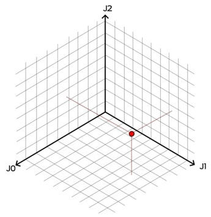 |  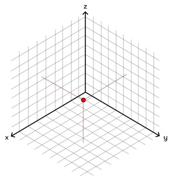 |
|:--:| :--:|
| *Joint space* | *Cartesian space* |

Since each robot state can be described by both joint or xyz values, there must be a function that connects points in the joint space to xyz space, and vice versa. The function that tells what XYZ values a point in joint space corresponds to is the **"Forward Kinematic"** function and the function that tells what joint values correspond to a point XYZ space is called the **"Inverse Kinematic"** function. 


<div style="border: 1px solid black; padding: 10px; background-color: #faeeb6;">
<h3 style="margin-top: 0;">Note</h3>
For measuring the XYZ values we’ll use the millimeter (mm) units, which is in accordance with the accuracy of most of the industrial robots. 
</div>

| 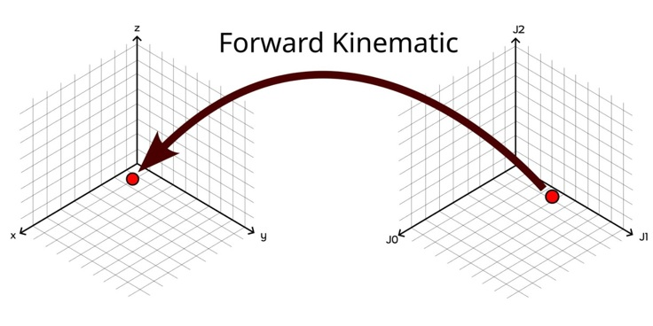 | 
|:--:| 
| *Forward Kinematic Function* |

| 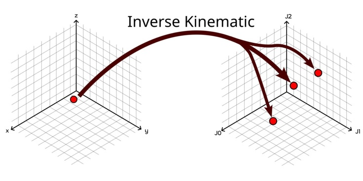 | 
|:--:| 
| *Inverse Kinematic Function* |

The forward kinematic function has a unique solution, when you choose the values for joints, the XYZ values are definite. But the opposite is not true, as you can see in the figure above, each XYZ value corresponds to multiple solutions in the joint space via the inverse kinematic function, this means that there are different joint value states for the robot that correspond to exact XYZ values. This degeneracy that will appear when we use the inverse kinematic function opens the door to a lot of interesting possibilities.

#### **Orientation of Approach**
Choosing the 3 degrees of the end effector’s position XYZ values is not our only freedom while working with the 6-axis robotic arm. We can also approach the desired XYZ point with infinitely many possible orientations of approach.

|  | 
|:--:| 
| *We can approach a single point in XYZ space with infinitely many different possible orientations* |

There are many use cases for the ability to rotate the tool head of the robot while the position is fixed, for example after the robot grapples to an object it can rotate it in-place. Or if the robot is in charge of photographing a scene with a camera as the end effector,  it can change its view direction independent of the view position.

The important task would be to quantify this orientation/rotation so we could assign values to the state of the robot’s end effector’s rotation, in order to control it and to plan motions that include rotation as well as translation.

<div style="border: 1px solid black; padding: 10px; background-color: #faeeb6;">
<h3 style="margin-top: 0;">Note (Coordinate (Reference) Frame) </h3>
Every industrial robot is a combination of solid parts that are attached hierarchically, meaning that each part can move/rotate with respect to the part that hosts it in the hierarchy or in other words, its parent. On the other hand, each part’s movement or rotation affects all the parts lower in the hierarchy (children or grandchildren). To quantify this hierarchical and respective translation/rotation (which we will call transformation in the context of coordinate frames), it’s beneficial for us to use the notation of coordinate frames.

Every coordinate frame (CF) is defined by a point in space as its center, and three unit vectors X, Y, and Z that are all perpendicular to each other. Changing the center vector of a CF results in the CF’s translation and changing the X, Y, and Z axes results in the CF’s rotation.

There is a CF that is always intact and we compare all other CF’s with that. We call this CF the “World” coordinate frame. For example, in a real scenario, the World CF could be the coordinate frame that is created on the laboratory table that the robot is installed on.

Comparing two CFs for example comparing B to A, means finding a transformation that transforms A to B, finding both the translation and rotation needed to obtain B starting from A. As you can see there are many parameters needed to describe a CF with respect to another (4 vectors each of them with 3 components resulting in 12 parameters in total). There is a nice way of describing these 12 parameters using a 4x4 matrix:

</img>

But what are all these factors: 

•  r<sub>00</sub> : Projection of X axis of B onto X axis of A

•  r<sub>10</sub> : Projection of X axis of B onto Y axis of A

•  r<sub>20</sub> : Projection of X axis of B onto Z axis of A

•  r<sub>01</sub> : Projection of Y axis of B onto X axis of A

•  r<sub>11</sub> : Projection of Y axis of B onto Y axis of A

•  r<sub>21</sub> : Projection of Y axis of B onto Z axis of A

•  r<sub>02</sub> : Projection of Z axis of B onto X axis of A

•  r<sub>12</sub> : Projection of Z axis of B onto Y axis of A

•  r<sub>22</sub> : Projection of Z axis of B onto Z axis of A

•  l<sub>x</sub> : Projection of L onto X axis of A

•  l<sub>y</sub> : Projection of L onto Y axis of A

•  l<sub>z</sub> : Projection of L onto Z axis of A

Here L is the vector that starts from the center of A and ends on the center of B.
By projection of V<sub>1</sub> onto V<sub>2</sub> we mean the length of the component of V<sub>1</sub> that is parallel to V<sub>2</sub>. Also, note that the 0,0,0,1 values on the lowest row of this matrix are not just decorative and they make life easier when we actually use these matrices to perform multiple CF transformations consecutively.

We sometimes refer to a transformation matrix solely to a CF, by that we mean the transformation matrix that takes the World frame to this frame. The matrix for the world frame itself then becomes:

</img>

This is the unity matrix, and it represents a transformation that effectively does nothing! No rotation, and no translation. If the values on the last column become non-zero, then the transformation contains a translation, and when the 3x3 top-left part of this 4x4 matrix were different from 3 diagonal 1s, then the transformation also contains non-zero rotation.

Before continuing, let’s see some of the important and useful CFs in the Dorna TA, the terminology you’ll see here is widely used in the field of robotics and industrial robotics.

You are already familiar with the <b>World</b> frame.

Next up in the hierarchy of frames, is the robot’s <b>Base</b> reference frame (BRF). It is the coordinate frame connected to the base of the robot, the first static part of the robot. It’s useful to place the origin of BRF on the J0 axis of the robot, where this axis, coincides with the floor that holds the robot. We also choose the Z axis of BRF to be along the axis of J0, and the X axis of BRF to point along the robot when all joints are zero.

It makes life easier to choose the World frame to coincide with the BRF, but for example, in the case where the robot is on a rail, while the World frame is static, the base frame becomes dynamic and can be translated over time by controlling the new “Auxiliary” axis added to the system.

Next, there are 6 frames in the hierarchy, each one is a <b>Joint</b> frame, connected to a rigid part of the robot. The positioning of each one of these frames is out of the scope of this part of the course, but keep in mind that we always choose the frame’s Z axis to align with that joint’s rotation axis. Take a look at figures 2.3-2.8, there you can see the Z axis of each of their CFs.

The CF that sits on the very last moving part of the robot (excluding the parts/tools we attach to the robot) is the <b>Flange</b> frame.

The frame that is placed on the endpoint of the effector/tool connected to the robot is called the <b>Tool</b> frame, and the origin’s position of this frame is called Tool Center Point (TCP). Defining this frame for each tool is crucial if we intend to use that tool for touching anything. 

</img>

Please note that the Flange’s Z axis is perpendicular to the surface of the robot’s last moving part. The Flange’s X axis is on that surface heading toward the asymmetric dent, like the picture below.

</img>

</div>

#### **Axis Angles**
Assigning a 3D coordinate frame to the end effector of the robot is the first step for quantifying the robot’s rotation. This frame has its own X, Y, and Z axes that may or may not be parallel to the world frame axes.

| 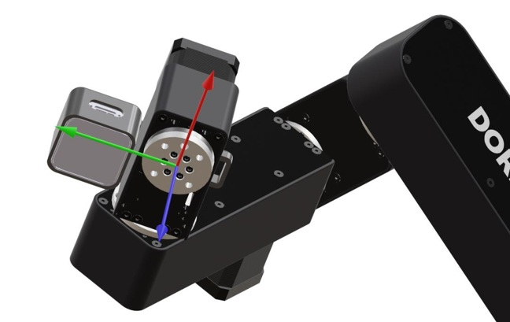 | 
|:--:| 
| *Flange coordinate frame.  We use the common color codes throughout this course: Red for X axis, Green for Y axis, and Blue for Z axis* |

A transformation can bring the BRF (base frame), to the the Flange frame, as depicted in figure 13. This transformation contains two parts, a translation and a rotation. The translation is described by the (x,y,z) vector we talked about before. In order to describe the rotation part; We can use the 9 values of the 3x3 rotation part from the transformation matrix, But of course keeping 9 numbers for rotation could be inefficient and troublesome.

| 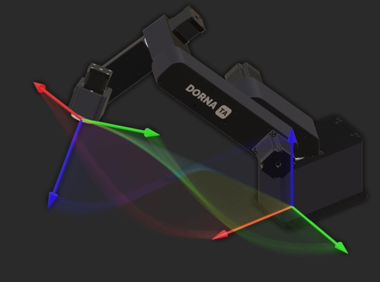 | 
|:--:| 
| *Transforming “Base” frame to “Flange” frame.* |

The good news is; that it is possible to throw away this complicated matrix notation and represent the rotation by only 3 parameters (or in some other ways 4 parameters). 

Here we use the so-called Axis-angles representation: three angles that we name (a,b,c). These 3 values combined with the robot’s position together form a 6-dimensional space for the robot’s state representation which has equal dimension with the space of 6 joint values. Any representation with less than 6 dimensions would be insufficient and any representation with more than 6 dimensions would be redundant.

<div style="border: 1px solid black; padding: 10px; background-color: #faeeb6;">
<h3 style="margin-top: 0;">Note </h3>
The Axis-angle representation of rotation uses the fact that every possible rotation can  be specified using an axis and an angle.
    
The three parameters that here we call them (a,b,c) together form a vector that we will call Θ for now. Θ’s direction in space specifies the direction of the rotation axis, and Θ‘s length specifies the amount or the angle of rotation (in the unit of degree).  This means that the amount of rotation (θ) is the square root of a<sup>2</sup> + b<sup>2</sup> + c<sup>2</sup>. The axis of rotation (a unit vector) is thus <b>n</b> = (a/θ, b/θ, c/θ).

Keep in mind that when the <b>n</b> arrow is headed toward us, then you’ll see the rotation is anti-clockwise. Also, keep in mind that the value of θ is always positive. Two opposite rotations have the same θ values but with opposite direction <b>n</b>.

</img>

</div>

<div style="border: 1px solid black; padding: 10px; background-color: #f0f0f0;">
<h3 style="margin-top: 0;">Exercise 1</h3>
In the figures below, we intend to apply a rotation to the CF in (1) to achieve the CFs in (2), (3), and (4). For each case, find the proper axis of rotation, the angle of rotation, and finally the axis angle representation (a,b,c).

<table >
<tr>
<td></td>
<td></td>
<td></td>
</tr>
<tr>
<td></td>
<td></td>
<td></td>
</tr>
</table>
</div>

#### **IK Solutions Classifications**
As mentioned before, The function that takes ```(x, y, z, a, b, c)``` and gives us the corresponding joint values ```(J0, J1, J2, J3, J4, J5)``` is called the inverse kinematic or IK in short. Most of the control systems in robotics are automatically capable of performing IK in real-time, and so is Dorna-TA’s control system. The user is free to use any representation for the robot state, and the robot will perform mathematical calculations needed to translate different representations to each other.

An interesting feature of IK is that it usually has multiple solutions. A specified ```(x, y, z, a, b, c)``` value corresponds to 0 or 1 or even more than one joint value. Sometimes there are up to 8 different solutions!

The points where there are zero IK solutions are called out-of-bound points, they are the points in Cartesian+Rotation space that the robot can’t achieve geometrically. For example, the maximum distance the robot’s arm can stretch is around 500mm, so any points outside a sphere with a radius of 500mm around the robot’s base, are probably out-of-bound.

There are edge cases for points that have only one IK solution. But most of the time the number of solutions is large. How does the IK system choose the best solution out of all the possible ones? What makes a solution better than the other?

Since we usually use the IK system to find the joint values for the endpoints of the robot’s motions, The best answer is always the answer that results in the shortest path to the robot’s current configuration. Choosing the nearest path usually guarantees the smooth movement of the robot between points in space.

It is possible to classify all the solutions of the IK using simple conditions, for simpler robots. But classifying solutions for robots with a large number of degrees of freedom, like the Dorna TA with 6 degrees of freedom, proves to be hard, due to a high number of solutions and their geometrical complexities.

 First let’s see, what does a “class of solutions” mean? *A class of solutions*: two robot configurations that are near each other in ```(x, y, z, a, b, c)``` space, are in one class of solutions if their joint values are near each other too.

Two IK solutions that are not in a class of solutions may be near each other in ```(x, y, z, a, b, c)``` space but they are far apart, in the joint space, so it’s impossible for a robot to get from one of these point to another on a straight line in the ```(x, y, z, a, b, c)``` space and in a short amount of time. We have to take care of this detail when we try to plan our motion in the next sections.

<div style="border: 1px solid black; padding: 10px; background-color: #c8e3c3;">
<h3 style="margin-top: 0;">Lab Exercise 2</h3>
While it was discussed that it’s hard to classify IK solutions for a general 6-axis robot like Dorna TA, there are two simple classifications of IK solutions that work approximately well in most cases. One of these classifications that breaks up all of the IK solutions into two categories can be simply determined by looking at the value of J0 and the other by the value of J2. 

<b>J0 classification</b>: judging by looking at the very first axis (J0) is the robot toward the end-effector’s position, or is it totally on the opposite side (with an approximately 180-degree shift in J0).

<b>J2 classification</b>: is J2 a positive value or negative value. 

<table border="1" cellspacing="0" cellpadding="10">
<tr>
<td></td>
<td><b>J0 toward goal</b></td>
<td><b>J0 backward from goal</b></td>
</tr>
<tr>
<td><b>J2>0</b></td>
<td></td>
<td></td>
</tr>
<tr>
<td><b>J2<0</b></td>
<td></td>
<td></td>
</tr>
</table>

Now consider these values for joints.
<table>
<tr>
<td>(</td> <td> 43.6,  </td><td> 53.3, </td><td>  88.9,</td><td>  -90.5,</td><td> 138.7,</td><td> -145.5 </td><td>)</td>
</tr> 
<tr>
<td>(</td> <td> 21.3,  </td><td> 109.6,</td><td> -81.5,</td><td>  56.9, </td><td> -87.0,</td><td> -84.3  </td><td>)</td>
</tr>
<tr>
<td>(</td> <td> -170.4,</td><td> 128.5,</td><td> -43.1,</td><td>  84.2, </td><td> 117.7,</td><td> 157.0 </td><td>)</td>
</tr> 
<tr>
<td>(</td> <td> -161.0,</td><td> 122.1,</td><td> -27.8,</td><td>  70.3, </td><td> 115.7,</td><td> 147.3 </td><td>)</td>
</tr>
</table>
Bring the robot to these joint values (by sending jmove command to the robot).
Check if all these joint values have the same XYZ values, and discuss how you can classify these IK solutions using the two methods you just learned.
</div>


#### **TCP**
No practical job given to an industrial robotic arm can be carried out without a proper tool attached. A tool usually has static and dynamic parts, that come on top of the robotic arm’s geometry. When the tool is connected to the robot, the **Flange** frame becomes unimportant, and the **Tool** frame becomes the frame that needs to be controlled. 

For example, when a gripper is connected to the robot and you intend to give a pick and place task to the robot, the position of the **Flange** frame is unusable, you have to align the robot’s TCP with the object you want to pick up. 

But to do this the controller has to know how to transform the Flange frame to the Tool frame.

This task is done using a simple constant transformation matrix that describes the **Tool** CF with respect to the **Flange** CF. We call this matrix the ```Tool_2_Flange``` matrix (2 stands for “respect to”). This 4x4 matrix contains a rotation part and a translation part. So it is possible for the **Tool** frame axes not to be aligned with the **Flange**. 

The Dorna Lab lets you easily assign the ```Tool_2_Flange``` matrix, by specifying its translational part by a displacement vector, and its rotational part by an axis-angle vector. 
| 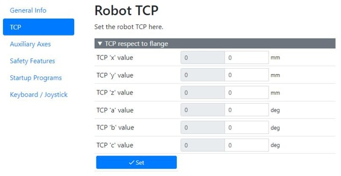 | 
|:--:| 
| *TCP setup in setting tab of Dorna lab* |

In order to assign the **Tool_2_Flange** matrix in Dorna TA by setting its displacement and axis-angle vectors, you can use the TCP section in the **“Setting”** tab of the Dorna Lab. Enter the values in the input fields and click on the “Set” button. After the values are assigned inside the controller, the gray values will change to your desired values.

---
## **Motion**
A robot’s motion is defined as a series of temporal interpolations of the robot's configuration between two or more states. Each motion is characterized by its initial and final points (or even middle points), It’s also modified by parameters such as velocity, acceleration ( and also “jerk” ), and the type of motion (e.g. line or joint move).

<div style="border: 1px solid black; padding: 10px; background-color: #faeeb6;">
<h3 style="margin-top: 0;">Note </h3>
    
Velocity is the rate of changing of the position in the unit of time, or more precisely speaking, velocity is the time derivative of the position, and of course, it has the units of <b>mm/s</b>. For example, if the z value of the robot changes 6 mm every 3 seconds, the velocity is 2 mm/s.

But this only holds if we are working with the XYZ (Cartesian) parameters to describe the robot's state. If the state is described using the joint values, then the velocity should be defined as the rate of change in the joint angles over time, and the unit we measure it in is <b>deg/s</b>.

Acceleration is the rate of changes in velocity over time, its measuring unit is then <b>mm/s<sup>2</sup></b> or  <b>deg/s<sup>2</sup></b>.

Jerk is the rate of changes in acceleration over time, its measuring unit is then <b>mm/s<sup>3</sup></b> or  <b>deg/s<sup>3</sup></b>.

</div>

### **Motion Parameters**

We’ll now take a look at the parameters that describe a motion and their roles:

#### **Start/End Points**

To command the robot to perform a motion you’ll have to send a message containing the instruction from which the robot could calculate the resulting/final state of that motion. It’s not necessary to submit the initial state of the motion for each motion command, because presumably, the initial point of each motion, is the robot’s state when that motion is going to be performed. After all, it’s only the goal that matters, and the initial point of the next motion was determined as the end point of the last motion command.

But what are the possible ways to send the endpoint information? As you’ve seen before, we have two possible ways to describe any robot’s state, using Joints-space or XYZ-space values. You can submit a motion command by specifying the endpoints in any of these two spaces.

An example of a motion command using joint values:
```JSON
{"cmd":"jmove", "j0":60.0, "j1":50.0, "j2":-30.0}
```
It is possible to miss some of the joint values in a command. It means that the missing joints are supposed to stay constant during that motion. Now this is an example of specifying a motion’s endpoint using Cartesian coordinates:
```JSON
{"cmd":"jmove", "x”:200.0, “a”:30.0}
```
Again, missing any values, means that value should stay constant. Note that you should only use joint labels or Cartesian labels, It is not possible to use both of them at once.

#### **Motion Types**
Now that the initial and endpoints of the motion are determined, the controller will calculate the nearest path between these two points and guide the robot along that path over a specified amount of time. We know that the nearest path between any two points is the straight line between those two points, but here is a problem: a straight line in joints-space ≠ a straight line in XYZ  space.

This odd problem has a deep consequence in the world of robotics, it always matters to choose between these two spaces to perform a straight motion. Users should have the freedom to choose between these two cases. They are free to choose initial/endpoints using any representation, but when it comes to connecting these two points, they have to specify the space.

| 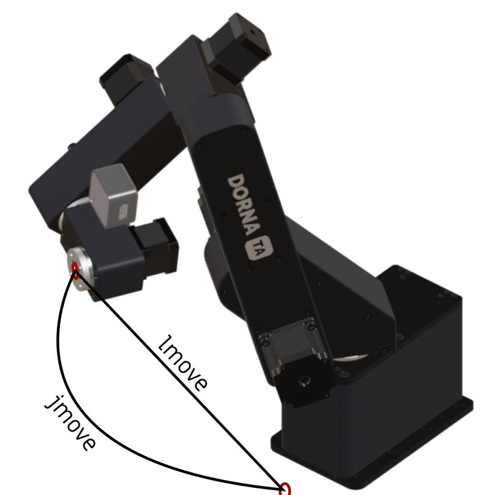 | 
|:--:| 
| *The difference between* ```jmove``` *and* ```lmove```*‘s path* |

- **Joint Move**
```jmove```s are motions that are straight lines in the joint space. If we take a look at the robot while it’s performing a joint space motion, we’ll see a simple and smooth-curve path, which is usually a little hard to predict, especially when the two points are distanced far apart.

Its best use cases are when we don’t care about the path the robot takes between two points, and we only care about the final result of the motion. Another use case for it can be when the distance between the start to the endpoint is very short, in that case, the ```jmove``` curve looks somehow like a line segment, so it becomes more predictable. 

All the robot’s joints move uniformly altogether in a ```jmove```. For example, if the starting point’s joint values are ```(0, 0, 0, 0, 0, 0)```  and the destination point’s joint values are ```(90, 0, 30, 0, 0, 0)```, then the robot has to increase J0 and J2 simultaneously. J0 increases 90 degrees and J2 increases 30 degrees, both at the same time. So J0 has to rotate 3 times faster than J2, and all the other joints have to stay constant the whole time.

While the joint’s motion are uniform in a jmove, the end-effector’s motion can be a little unpredictable, and it’s velocity and path can change over time. The end-effector’s rotation (e.g. axis-angles) also undergoes changes during a ```jmove```.
| 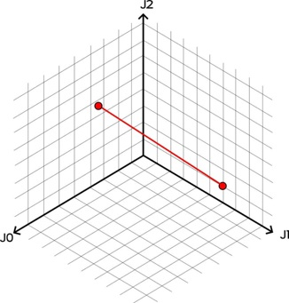 | 
|:--:| 
| ```jmove``` *is a straight and uniform motion in joint space* |

The command for a joint move should assign ```"jmove"``` to the ```"cmd"``` key.

- **Line Move**
On the other hand, ```lmove```s are motions that are straight lines in the XYZ space. The path of the end-effector is a straight line, and its velocity is also uniform and smooth.

The use cases for ```lmove``` are usually when we intend the robot to move on a predictable and deterministic path and we need the path to be as short as possible, and also for when we need the end-effector’s rotation to be precisely controlled while it is moving on the path. 

The ```lmove``` path does not project onto a straight line in the joint space, so we don’t expect joints to move uniformly in this kind of motion. The motor’s speed may change differently for each joint while an ```lmove``` is being performed. 

| 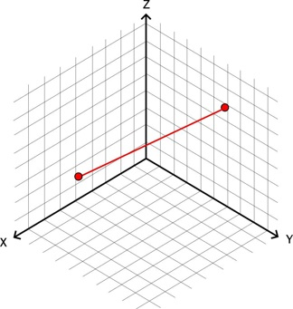 | 
|:--:| 
| ```lmove``` *is a straight and uniform motion in Cartesian space* |

The command for a line move should assign ```"lmove"``` to the ```"cmd"``` key.

There is a special third option for the motion type, that can be achieved in Dorna robots, which is not a straight line in any of the two spaces, that is:

- **Circle Move**
```cmove```s are motions that resemble moving on the perimeter of a circle. A circle is a set of points in space that are at the same distance from a center point and all reside on a plane. As for our robot, a circle is uniquely specified with three points:

  - The first point on the circle, which is the current position of the robot.
  - The second point on the circle, which is the final position of the move,
  - A midpoint on the circle, which is a point that the ```cmove``` will pass through before reaching the final point.
  - Another parameter of the circle is the ```turn``` parameter which specifies how many full turns the robot will make in addition to the initial arc that connects the initial point to the final point through the midpoint.
    
So the circle move is created using three points, instead of two, which are start, mid, and end points. There is always a plane passing from three points in space. So the circle’s plane is determined. Also the center point and radius of the circle, and the direction of rotation on the circle, all can be determined from these 3 points. 

| 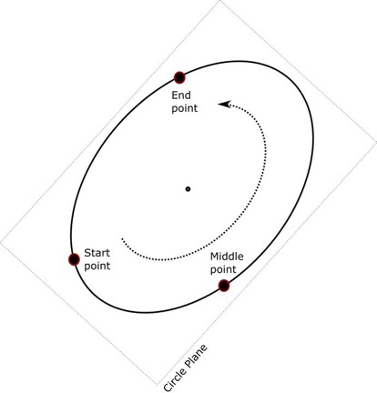 | 
|:--:| 
| *Using the start, middle, and end points, all the properties of the ```cmove``` path is determined* |

In the picture above, the robot traverses the circle anti-clockwise to go through the mid point during the motion. After reaching the endpoint for the first time the robot performs ```"turn"``` numbers of full circle turns before finishing the ```cmove```.

The command for a circle move should assign ```"cmove"``` to the ```"cmd"``` key.

#### **Relative/Absolute Motion**

Until now you’ve only learned about the absolute motions, motions in which you acquire the absolute position of the end point in XYZ or joint space. On the other hand, the relative motion treats your input x, y, z, a, b, c, or joint values j0, j1, j2, ... as the amount of increment you want these parameters to take starting from their current value. 

The ```"rel"``` label has a default value of zero. If you don’t commit ```"rel":1``` with your command it reads your command as an absolute motion. If the current j0 value is 30, the command

```JSON
{"cmd":"jmove", “rel”: 1, "j0":60.0}
```
results in the value of 90 for j0. The missing values again stay unchanged.

#### **Dynamic Properties of Motion**
Velocity, acceleration, and jerk are the three dynamic properties of the motion that we defined before. Each one of these values can be assigned for a motion command, using proper labels. 

- ```vel``` : For velocity
- ```accel``` : For acceleration
- ```jerk``` : For jerk
 
These will specify the “maximum” value or the upper bound the motion planner uses for velocity, acceleration, and jerk. The motion planner tries to perform a motion as fast as possible, using your input (or default) values of velocity, acceleration, and jerk, but it also has the job of keeping the motion uniform and smooth. It has the job of stopping the robot at the end of motion commands smoothly. When we input high values for these dynamic properties of motion, the motion planner avoids abrupt brakes and sudden changes in the motor speeds.

The values of velocity, acceleration, and jerk are all very hard to measure, so how can we set the right values for them?

Usually, choosing the right/optimal value is done by trial and error. The optimal values will result in a motion that is done in the shortest amount of time and has a smooth start and end. Here are a few guidelines to pick the optimal values for your application:
- Start with moderate values of vel, accel, and jerk. (see table below)
- Increase or decrease vel, depending on your load. For higher payloads, you should limit max vel.
- Increase or decrease accel values based on the load. accel value defines how fast you will reach the maximum speed and is limited by the torque that motors can generate.
- Increase or decrease jerk, depending on the jerkiness of the motion with the determined vel and accel parameters. The jerk parameter plays a big role in the final quality of the motion, especially at the start and stop of the motion. Higher jerk values translate into more vibration at the start and stop. Lower jerk values, translate into vibration-free and smooth motion. Increase or decrease jerk to find the desired motion smoothness.

<table>
<tr>
    <td>Parameter</td>
    <td>Moderate Value </td>
    <td>Upper limit for small payloads</td>
    <td>Upper limit for high payloads</td>
</tr>
<tr>
    <td>vel</td>
    <td>100 (Joint), 200 (Cartesian) </td>
    <td>500 (Joint), 1000 (Cartesian) </td>
    <td>250 (Joint), 500 (Cartesian) </td>
</tr>
<tr>    
    <td>accel</td>
    <td>700 (Joint), 2000 (Cartesian) </td>
    <td>3000 (Joint), 5000 (Cartesian) </td>
    <td>1000 (Joint), 3000 (Cartesian) </td></tr>
<tr>
    <td>jerk</td>
    <td>3000 (Joint), 8000 (Cartesian) </td>
    <td>10000 (Joint), 50000 (Cartesian) </td>
    <td>5000 (Joint), 10000 (Cartesian) </td>
</tr>
</table>

#### **Continuous Motion**

In many applications, you might need to create a continuous transition from one motion to another motion without a full stop at the end of each motion. Dorna motion planner makes it possible with a feature called continuous motion.

With continuous features activated, the controller will connect each new motion to the previous motion that it has in its queue. As soon as the controller runs out of motion commands in its queue, it will stop at the end of the last motion command.

In Dorna TA continuous motion only applies to consecutive ```jmove``` or ```lmove``` motion commands. If after a ```jmove``` command, there is an ```lmove``` command, the continuous feature does not apply.

In order to activate the continuous motion option for a motion command set the ```"cont"``` key to 1. Setting it to 0 (the default value) disables this feature.

Since by physics laws, it is impossible to traverse two lines that are not collinear in space, without a full stop at the sharp corner, the continuous motion feature, does two things to traverse connecting lines smoothly:

1. It makes the corners of connecting lines rounded by replacing the corner with a smooth curve that gradually changes direction from one line to the next. The user can control the radius of the rounded corner by changing the parameter ```corner``` of the move commands.
   
3. It reduces the speed of the curve at sharp edges if needed.

| 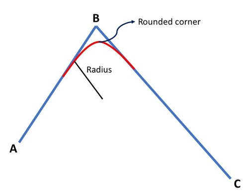 | 
|:--:| 
| *Using the continuous motion option and the radius value we can smooth out the sharp edges between two path segments* |

To make the corners traverse smoother, reduce the maximum velocity (vel) of the motion and increase the ```corner``` parameter. A larger corner radius or smaller velocity will make smoother corner traverses.


## **Accuracy and Precision**

Accuracy and precision are important concepts in the field of industrial robotics, that are crucial to the performance and reliability of robotic systems. Both terms, while often used interchangeably in everyday language, have distinct meanings in engineering and robotics.

**Accuracy** refers to the closeness of a robot's movement or positioning to a specified target or desired value. In industrial robotics, accuracy is critical for tasks that require exact positioning, such as assembly, welding, and machining. An accurate robot can consistently reach the intended target, minimizing errors that could lead to assembly failures. The accuracy of the robot can be improved by proper calibration of the joints. 

**Precision**, on the other hand, denotes the robot's ability to repeat a specific movement or achieve the same position repeatedly under the same conditions. It is often referred to as repeatability. Precision is crucial in processes where consistent performance is needed over multiple cycles. For instance, in a production line, a robot must consistently place components in the same spot to ensure uniformity and quality in the final product. High precision reduces variability and increases the predictability of robotic operations. For example, Dorna TA robots can repeat a task with an error smaller than 0.1mm.

The interplay between accuracy and precision is a determining factor in the performance of industrial robots. A robot can be precise but not accurate, meaning it can consistently reach the same position, but that position may not be the correct one. On the other hand, a robot can be accurate but not precise, hitting the target correctly in different positions, but not consistently. Ideally, industrial robots should be both accurate and precise to ensure optimal performance and product quality.

<div style="border: 1px solid black; padding: 10px; background-color: #c8e3c3;">
<h3 style="margin-top: 0;">Lab Exercise 3</h3>

</div>

<div style="border: 1px solid black; padding: 10px; background-color: #c8e3c3;">
<h3 style="margin-top: 0;">Lab Exercise 4</h3>
<b>Testing out the continuous motion</b>

Without using the continuous motion option, the robot has to stop completely at the end of each motion to be able to maneuver the sharp edges. This results in a lot of unnecessary time wasted on deceleration and acceleration. This may not seem very important in some applications but in many cases avoiding unnecessary brakes is a need. 

In this exercise you are asked to create a set of commands, that will take more than 20 seconds to run, and have sharp angles between two consecutive paths, using multiple <b>"jmove"</b> commands. 

Prepare the exact set of commands in two versions, one with <b>"cont":0</b> , and one with <b>"cont":1</b> and the <b>"corner"</b> parameters chosen properly. To set a proper value for the corner parameter, first start with a small number, and go up until the motion looks continuous enough.

possible image.

Run both the continuous and discontinuous versions of your commands. For each one of the two versions use a precise stopwatch to measure the time it takes the robot to complete the commands.

Compare the times. How much percent the continuous motion is faster?

</div>