# **7. Vision Basics**

Computer vision is pivotal in programming industrial robotic systems because it provides robots with the "eyes" needed to interpret and interact with their environment. This technology enables robots to perform highly precise and adaptable tasks, such as quality inspection, object sorting, and assembly operations. By leveraging computer vision, robots can identify and locate objects, assess their orientation, and make real-time decisions, which significantly enhances their efficiency and accuracy in manufacturing processes.

Traditional robotic systems often rely on pre-defined paths and operations, limiting their adaptability to changes in the production line. In contrast, robots equipped with computer vision can dynamically adjust their actions based on visual feedback, allowing them to handle a variety of tasks and adapt to new or unexpected situations. This capability is crucial for modern manufacturing environments that demand high levels of customization and rapid production changes. By integrating computer vision, industrial robots have become more versatile, capable, and essential for the future of automated manufacturing.
In this section, we will review the fundamental concepts of computer vision that will help us add basic vision and detection features to our robot programming toolbox. This chapter will benefit from the well-known detection library OpenCV for its goal. The Dorna robotics also features simple tools, that let you use the OpenCV features more easily for your robotic application.


## **Fundamental Concepts of Vision in Robotics**

The ultimate goal of using vision systems in robotics is to convert the information stored in captured images of the robot’s surroundings into three-dimensional data about objects. This transformation enables us to plan the robot's movements and interactions with these objects. In many real-world scenarios, the state of the environment is not entirely deterministic, so we need to continually update our information about the surroundings. Utilizing cameras and vision systems is the most versatile and effective way to achieve this dynamic understanding.

Basic vision methods, such as those implemented in the OpenCV library, rely on detecting patterns in images and subsequently extracting spatial data from these patterns. Various detection techniques hinge on identifying specific patterns within the image. For instance, edge detection, feature matching, and contour finding are fundamental processes that allow a vision system to interpret the spatial configuration and characteristics of objects within its field of view. By recognizing these patterns, the system can infer distances, shapes, and orientations, which are crucial for accurate object manipulation and navigation.

### **Types of Cameras**
When it comes to vision in robotics, a variety of cameras can be employed, each offering unique advantages depending on the application. The types of cameras can be categorized based on the type of the data they offer, or based on the method they acquire their data. 

#### **RGB Cameras**
RGB cameras capture images in the red, green, and blue color channels, producing high-resolution, color images. They are widely used for tasks such as object recognition, color-based sorting, and environmental mapping. However, they do not provide direct information about the distance or depth of objects.

#### **Depth Cameras**
Depth cameras, such as Microsoft Kinect and Intel RealSense, provide information about the distance of objects from the camera. This additional dimension of data is crucial for a variety of robotic applications. Knowing the exact distance and dimensions of an object allows for precise grasping and manipulation. Depth data enables the creation of accurate 3D maps of the environment.

A depth map means per-pixel depth values, this value measures how far a ray originating from that pixel can go before intersecting with an opaque surface. 

| | 
|:--:| 
| *The depth value of a pixel* |

 Different technologies are used for extracting the depth data. For example:

 - **Stereo Cameras**: Stereo cameras use two or more lenses to mimic human binocular vision, allowing the system to perceive depth through the parallax effect. By comparing the images from the different lenses, stereo cameras can calculate the distance to objects. This method is particularly useful for creating real-time maps of unknown environments.

 - **LiDAR**: LiDAR (Light Detection and Ranging) systems emit laser beams and measure the time it takes for the beams to return after hitting an object. This technology creates highly accurate 3D models of the environment and is commonly used in autonomous vehicles and drones.

| | 
|:--:| 
| *Showing an RGB+depth map, The blue means near, and red means far from the camera* |


The camera installed on the Dorna TA that is used in this course is an Intel Realsense D450 that outputs a depth map as well as the RGB map of the surroundings. It means that for each of the 1280x720 pixels, we get 3 color values (red, green, and blue) plus a depth value. This camera calculates depth using the two-channeled stereoscopic technology and its depth value has around 2% accuracy at a distance of 50cm (the error will increase for larger distances and decreases if the object is closer) meaning that it may report the distance of a real 50cm distance as 51 or 49 cm.

There are many options for camera installations in the field of robotics. In some cases, the camera is installed somewhere fixed with respect to the robot’s base and covers the robot’s working range in its field of view. But in the case of the Dorna TA robot, the camera is attached to the robot’s arm. This configuration is called the “Eye in Hand” configuration. This allows the robot to have a dynamic viewpoint, providing real-time visual feedback from the perspective of the tool or gripper. This configuration enhances the robot's ability to interact with objects, offering precise control in tasks like assembly, inspection, and manipulation.  This configuration has enhanced flexibility and versatility but demands complex calibration and coordination, and sometimes the camera can be blocked by the arm or other objects, limiting visibility.

|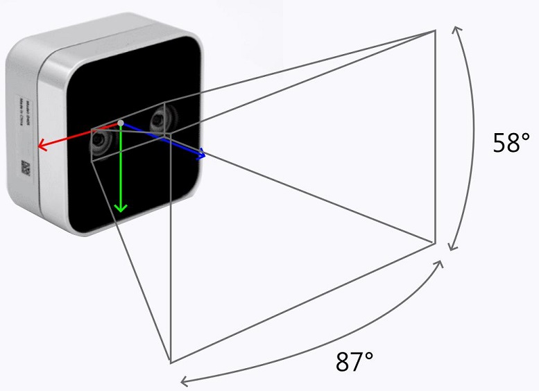 | 
|:--:| 
| *Intel Realsense D450 camera and its depth of field* |

<div style="border: 1px solid black; padding: 10px; background-color: #faeeb6;">
<h3 style="margin-top: 0;">Note</h3>

The camera coordinate frame is attached to the camera and contains enough information to represent the camera’s position and orientation in the 3D world. The origin of this frame resides somewhere on the light sensors of the camera where the image is being projected, its Z axis is perpendicular to the projection screen, and the X, and Y axes, are usually parallel to the projection screen. If you view these axes from the camera’s perspective, you’ll see that the X-axis points toward your right, and the Y-axis points downward. You can observe these axes in the figure above.

We can also talk about another coordinate frame, the image CF which is a 2 dimensional coordinate frame that we use to identify points in the images. This CF works like this: the origin of the coordinate frame resides in the upper-left corner of the image. The X axis is toward the right, and the Y axis is toward down. The input image has a width and height parameter measured in the unit of pixels, which is constant and depends on the type of camera you are using. For example **height** = 720px and **width** = 1280px for the camera we are going to use. 

The point in the lower right corner of the image is the point with maximum values of x and y equal to width and height respectively. Any point outside the rectangle defined by the screen height and width is considered out of bounds and is inaccessible using our maps.

|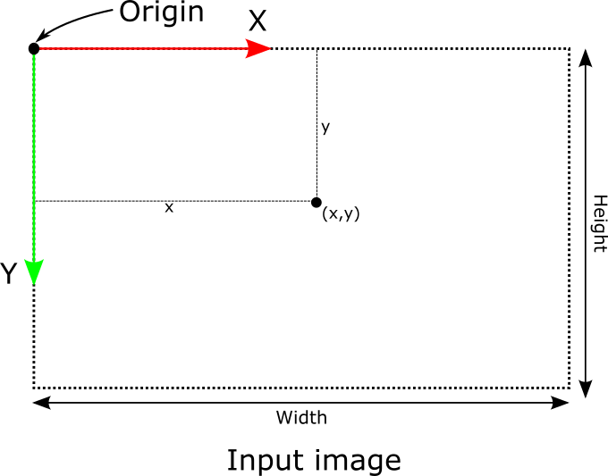 | 
|:--:| 
| *Image coordinate frame* |

</div>

---
## **Detection GUI**

To find the position of the objects in the environment, the application should first automatically detect the presence, the number, and the position of the desired objects relative to the camera frame, based on the input image. The detection part is done mostly based on the input RGB map, but to extract the 3d position information, we usually have to use the depth map. 

OpenCV performs object detection through a combination of image processing techniques. The process generally involves several key steps. Here we will not go through a detailed review of how OpenCV works, and how an OpenCV workflow should be created because that would take a complete course for itself. Instead, we will learn how to use OpenCV through a prepared graphical user interface to create simple yet useful programs for a wide range of robotic applications. 

Now let’s start working with this GUI by first opening the Jupyter environment using Dorna Lab. Then download and navigate the notebook “detection_gui” from the “example” folder of the [“dorna_vision” repository on GitHub](https://github.com/dorna-robotics/dorna_vision). Run the code cell in that notebook so the GUI starts working.

Here is the first look at the GUI you’ll encounter with:

|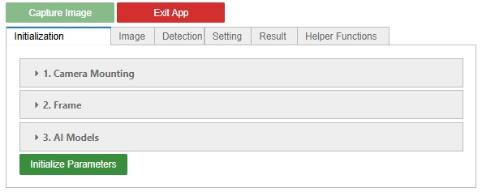 | 
|:--:| 
| *Detection GUI* |

### **Input and Adjustments**
You should first select your input source, in our case, it would be the input from the Intel RealSense camera, but you are also able to use a captured image as your input by choosing the option from the “Source” dropdown list. Click on the “Capture” button, so the captured image (shown below the GUI) gets updated.

Note that it’s important to click on the **“Terminate the app”** button when you are finished working with the GUI.

The next step is to perform adjustments on the raw input image before starting to work on detection. These adjustments are going to help the program to perform better detections. So start by clicking on the “Visual adjustment” tab. The options for adjusting the image are as below:

#### *Region of Interest*
Consider this scenario: you are programming a vision system for a conveyor belt in a factory that moves small boxes around. Your goal is to check the boxes passing on the conveyor. However, the camera's field of view includes a lot of unnecessary scenery from the environment. There are parts of the input image that you can confidently delete without causing any errors in the vision process. These are regions where you know the boxes won’t pass.

In this scenario, masking out these regions is beneficial. First, you reduce the number of pixels your processing unit has to handle for detection. Secondly, by specifying a valid region, you lower the possible risks of erroneous detections from invalid regions.

To specify the region of interest for your application, head to the “Region of Interest” sub-panel, and start drawing the desired polygon on the image below by clicking on it. 

|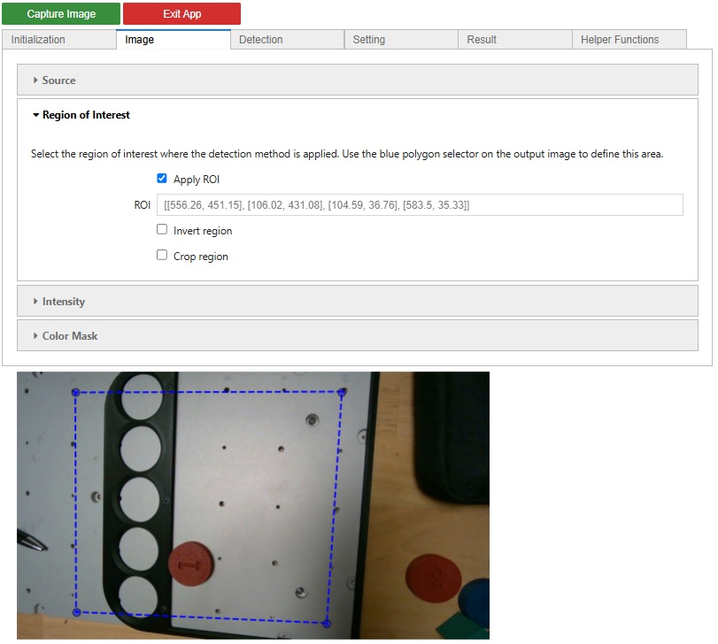 | 
|:--:| 
| *Region of  interest specified using the blue polygon, notice that hovering the mouse on the input image will show you options for interacting with it. The most important ones let you zoom and move the picture around* |

Check the “Apply the ROI” checkbox to make the region of interest active (this option is also present in the other adjustment sub-panel sections and should be checked if we want to use that adjustment feature). You can also invert this region (the region of interest would then be outside the polygon instead of inside it) by checking the “Inver the region” checkbox.

#### **Intensity**
The options in this section help you change the brightness and contrast of your input image, this may be helpful to enhance the quality of the image, when the light condition is bad, or colors used in the scene are indistinguishable. Play with these options until you achieve a clear and readable image, do not overuse these options on the image, because it will cause artifacts and erroneous detections.
|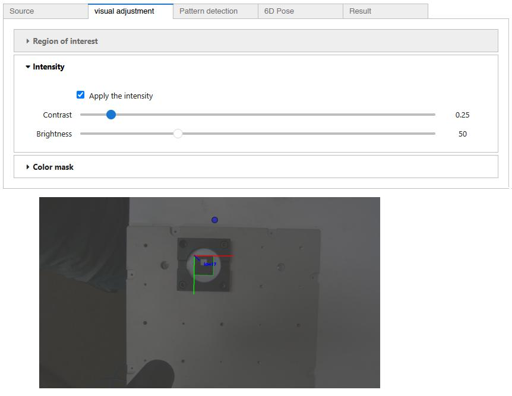 | 
|:--:| 
| *Setting Contrast and Brightness of the input image, to make the features more visible* |

#### **Color Mask**
Color masking is a feature similar to the “Region of interest”, in that instead of specifying a region on the image to be masked for the process, you specify a region in the color space for being processed. For example, if the boxes on the conveyor belt are only in blue colors, so there won’t be any reason to process pixels that are any color but blue. So you should mask out any other color. 
|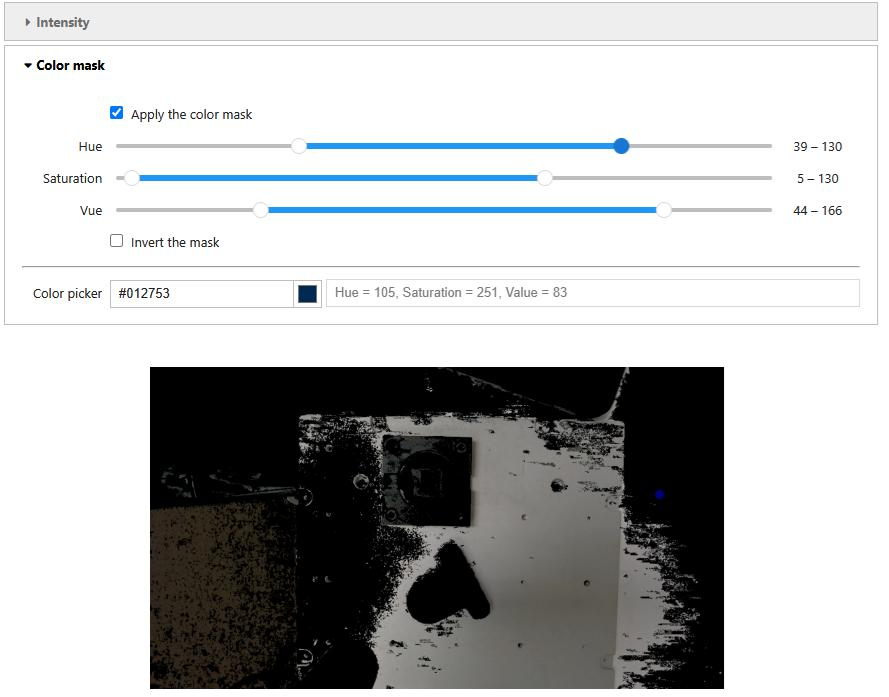 | 
|:--:| 
| *Color masking tool* |

Use the color picker option to first select the main color you want to mask, use the obtained HSV (Hue, Saturation, Vue) values as the center of the HSV mask regions, and expand the lower/upper bound sliders for each value around these center values to obtain your desired masking region in the color space.

The “Invert the mask” button also comes in handy if you want to delete a specific color region from your image.

### **Pattern Detection**
The next panel in the GUI is where we plan for pattern detection. First, we should select the kind of “Pattern” we want to detect in the image that suits our application, and then we need to tune the detection algorithm parameters to make it detect properly. Here we will introduce the pattern categories that this GUI supports, which usually suffice many real-world applications.

#### **Aruco**

Aruco markers are widely used in vision detection systems for their ability to provide robust, efficient, and accurate localization and identification. These markers are square fiducial markers composed of a unique binary matrix that can be easily detected and decoded by computer vision algorithms. Each marker has a distinct ID, allowing for individual recognition and tracking, similar to the barcodes on supermarket items. Since the shape, size, and patterns of these markers are known, OpenCV is capable of determining the pose of these markers (translation and rotation) in 3d space accurately without the need for a depth camera. This makes Aruco markers an invaluable tool for systems that require precise position and orientation information.

|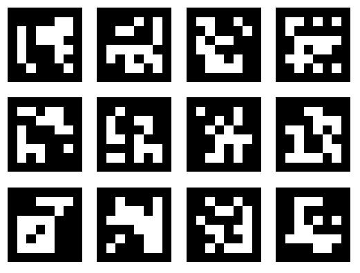 | 
|:--:| 
| *Sample Aruco patterns* |

Some tools easily generate these patterns for you. For example, visit this [website](https://chev.me/arucogen/). Here you can select the matrix size of the Aruco pattern (e.g. 4x4 or 5x5). With each matrix size, you can have pattern IDs starting from 0 to a maximum value (e.g. for 4x4 you can cover 1000 IDs). These patterns are distinguishable for the OpenCV algorithms even if they are rotated, or tilted. Afterward, you can select the ID number (the specific pattern) and the size of the pattern in mm. It will generate a pattern for you that you can save and print on paper to use in your pattern detection application.

To detect Aruco patterns using the GUI options, head to the “Pattern detection” panel and select “Aruco detection” in the “Method” dropdown. 

| | 
|:--:| 
| *Aruco detection in GUI and possible “Dictionary” values* |

You have to specify the matrix size (e.g. 4x4) and the maximum range of the IDs you want to be covered (e.g. 50). The list above shows the possible options in this dropdown. For example, the Aruco pattern that has been detected in the figure above is the distinct “id=17” pattern in the 4x4 dictionary. The output image will show you the coordinate frame that has been detected that attaches the marker, and the id value identified.

Use the “Marker length” value to specify the size of the pattern in mm. This is important for position detection since the algorithm uses the apparent size of the pattern to detect its position.
Use the default values for the remaining options that will help you refine the detection. You are also free to test out the effect of other options in these refinements.

<div style="border: 1px solid black; padding: 10px; background-color: #c8e3c3;">
<h3 style="margin-top: 0;">Lab Exercise 1</h3>
    

Create the patterns for IDs 1 to 6 in the 4x4 Aruco dictionary using the website recommended before.

Print these markers on A4 paper and cut them out using a scissor.

Draw or print the pattern below on a cardboard with each square being the same size as the printed Aruco. Cut out this pattern and fold it into a cube, use tape to hold the connections in place. Paste the  6 printed Aruco markers onto the sides of the cube.

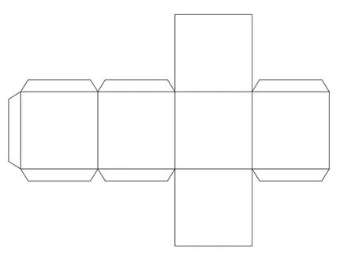 

You have created an Aruco dice! Use the GUI to detect the top side’s value of the dice. Roll around your dice and read the obtained values using the GUI.

</div>

#### **Ellipse**
Ellipse is a commonly used pattern in detection applications. It can help us solve many real-life problems easily. It has a simplistic geometrical structure with only 2 parameters describing it (major and minor axis sizes), but at the same time, it can be mapped to a wide range of complex shapes. Unlike the Aruco pattern detection, the algorithm is not capable of finding the 3D pose of this pattern, because the apparent elliptic shape may be mapped to a wide range of possible shapes in the 3D world. To find the pose for this pattern (and the patterns afterward), we have to use depth information from our stereo camera.

|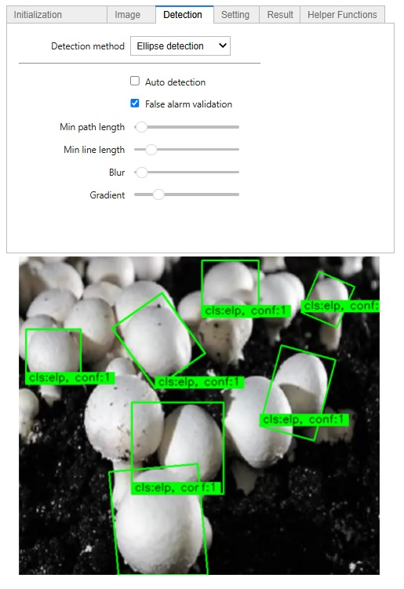 | 
|:--:| 
| *Ellipse pattern detection in GUI. The GUI uses the magenta rectangle as the rotated bounding box for the detected shapes and the shape itself is shown using the light green color* |

The two most important parameters controlling the ellipse detection are “Axes range" and "Ratio”:

- **Axes Range**: Determines the range of the values the axes size should be (measured in pixels). For example in the picture above there are many smaller circles or some very large circular patterns that we do not want the algorithm to detect, so we limit the axes range in a way that only the ellipses (or circles) with our desired size are detected.

- **Axes Ratio**: Axes ratio value is defined as the ratio between the ellipses’s smaller axis size to its larger axis size. Hence the axes ratio value must be in the range (0,1). An ellipse with an axes ratio near 1 looks like a perfect circle, and an ellipse with an axes ratio near 0 looks very stretched and thin. You have to also select a proper axes ratio range with which you can limit the algorithm to only detect your desired shapes.

Use other options available for this method only if configuring these two values is not enough for you to perform the detection task properly. We will not go into details of their specific effect on the detection algorithm, you may find out this just by playing around with them.

#### **Polygon**

Polygon detection brings us one step further for detecting more complex patterns.  
We expect the polygon pattern to have pointy edges and flat sides. Here you can specify the number of sides, and your expected range for the “Area” (in pixel2) and “Perimeter”(in pixels).  Both these values kinda represent the size of the polygon, and the ranges should be tuned carefully so the algorithm does not detect unwanted patterns.

In this section, you have also given options to control one step of the detection workflow right before the actual detection. The actual version of the input image that is being fed to the polygon detection algorithm can be seen on the right-hand side of the panel. As you can see it can be a binary image (each pixel can only take “white” or “black” values), and you have control over the parameters that control how these black/white values are assigned to the pixels. Play around with these options (if needed) to achieve a clear image where the pattern you wish the algorithm to detect is visible and bold. 

|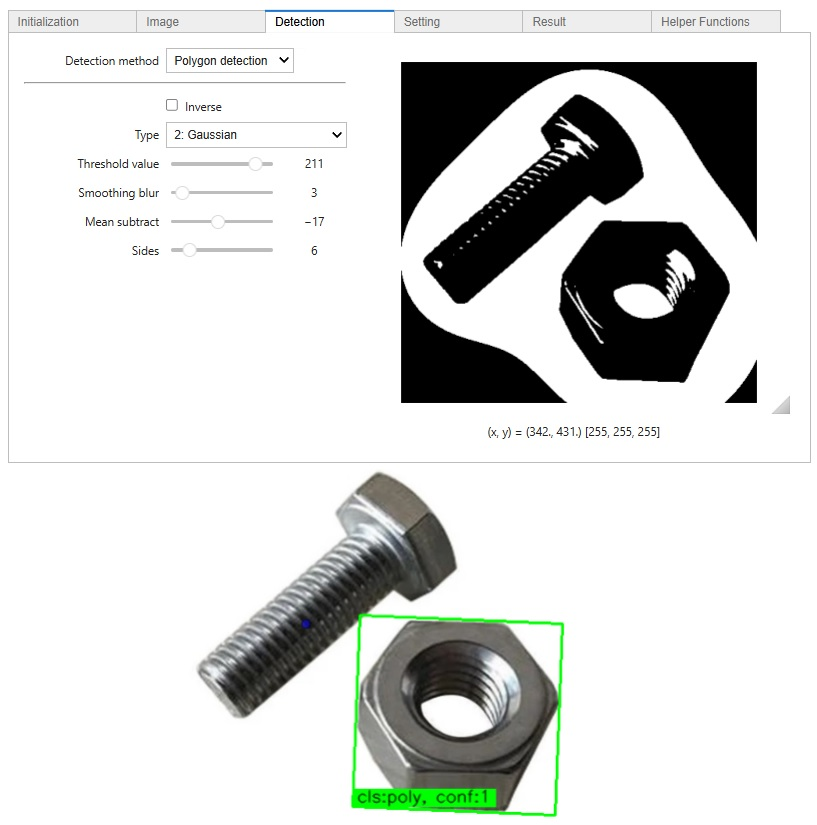 | 
|:--:| 
| *Polygon detection in GUI. The region of interest has also been activated for this example* |

#### **Contour**
Contour is the most complex achievable pattern in this application, which can cover all possible connected patterns and shapes for us. The contours generality has its pros and cons. The good news is that we can use contour to detect complex structures that could not be modeled properly using polygons or ellipses, but the bad news is that since the contour shape is unlimited it may wrongfully detect patterns we didn’t wish for.

The options in this case are similar to the “Polygon” detection section. You have the “Area” and “Perimeter” options to specify the size range of the contour. 

|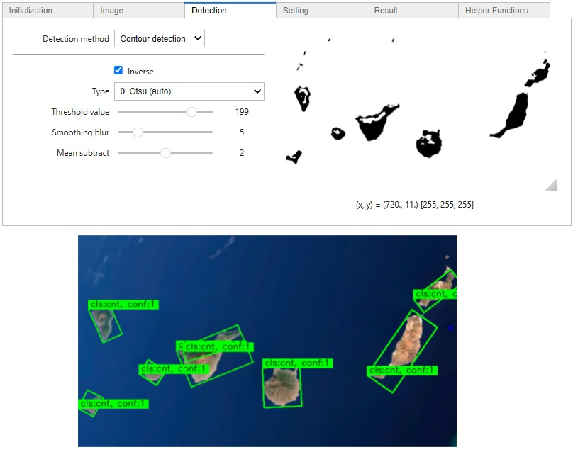 | 
|:--:| 
| *Contour detection in GUI used to detect a rather complex object* |


### **6D Pose**
As it was discussed before, the only pattern detection algorithm that is capable of determining the position and rotation (3D rotation + 3D position = 6D pose)  of the detected object in the 3D space is the Aruco detection algorithm, and the other algorithm results are only limited to the 2D screen space.

However since we are using a stereo camera with depth information for each pixel, it is possible to translate the output results of these detection algorithms from the screen space to the 3D space.

To do so Dorna’s detection GUI gives you an effective tool. But first, we should ask which pixels on the screen correspond to key points of the object in 3D space. The first solution that comes to mind for this problem is to follow the ray that passes the center point of the detected pattern’s bounding box, and see where it collides with the object in 3D space. We can report that point as the position of our object in 3D space. This solution has some disadvantages, firstly what if the ray passing the center point did not even collide with the object (for example this is the case for the object in the figure above), secondly it’s not possible to find the rotation of the object using only one point.
 
The Dorna detection GUI’s approach to this problem uses three key points for each instance of the detected pattern to find its pose. We should choose these 3 points in a way to be sure that they reside on the surface of our object. 

Head to the “6D pose” section, the detected pattern is represented here by an ellipse. Note that the larger axis and the shorter axis here are going to get rotated and rescaled for the bounding box to match with the bounding box of the detected pattern. You should specify 3 points on this ellipse that are going to be mapped on your object’s surface. 

|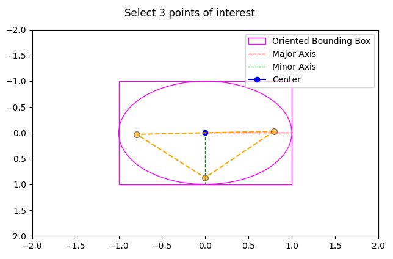 | 
|:--:| 
| *The interactive environment that lets you choose the 3 sample points by clicking* |

While selecting the points on the ellipse, keep an eye on the output result below, you’ll be able to observe the yellow dots appearing on the detected pattern, this helps you find the proper place for setting the sample points.

|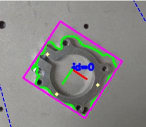 | 
|:--:| 
| *Three sampling points appearing on the detected pattern* |

From now on, whenever an instance of the pattern is detected, the algorithm uses these 3 points like the picture below, to form a triangle in 3d space. The algorithm will calculate your object’s position and rotation in 3d space based on this triangle’s configuration in 3D space. 

|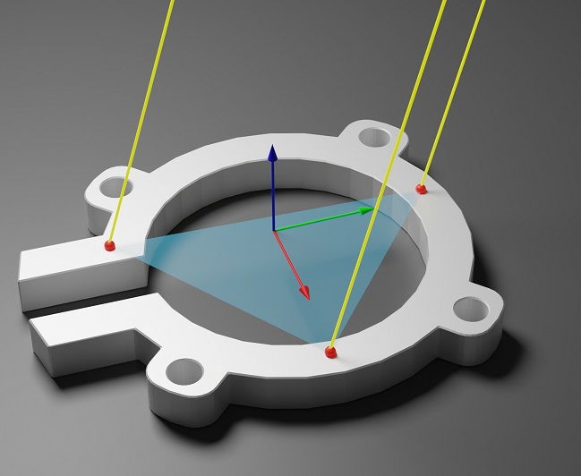 | 
|:--:| 
| *Calculating the object’s 6D pose from 3 sample points on object surface* |

As you can see in the figure above, if you miss-place one of the three sample points, its corresponding ray will hit the ground (or whatever there is in the background), and the triangle becomes tilted and displaced, causing an error in the calculated 6D pose values.

### **GUI Output**
The result panel of the GUI gives us two options:
    • We can either extract the output values of the detection right away.
    • Or we can export the configuration we just made using GUI to use easily in the Python API. Copy the configuration code to use it later.

|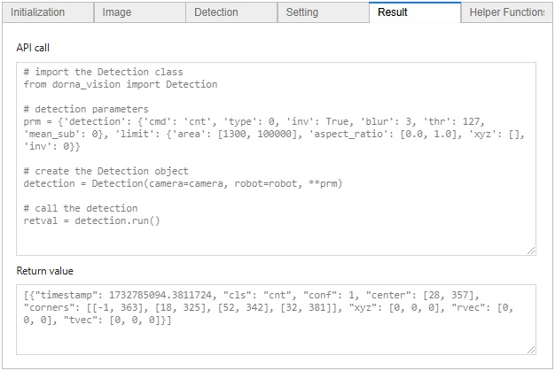 | 
|:--:| 
| *Sample result outputs* |

The output data called “Return value”, is a list of dictionaries each one corresponding to one of the detection instances. For example in the figure above, the list only contains one dictionary, that’s because there where only one instance detected. The values in the dictionary are described below.

- ```“id”```: The id of the detected instance. In the case of the Aruco detection, this equals the detected ID. In other detection methods, the “id” value just counts the different instances.
- ```“center”```: A 2D vector, in the pixel units, on the screen coordinates, representing the position of the bounding box of the detected instance.
- ```“corners”```: An array that holds the positions of the 4 corners of the bounding box.
- ```“xyz”```: A 3D vector (in mm units) in the camera’s frame, that represents the position of the detected object but only by following the center pixel.
- ```“tvec”```: The resulting translation vector from the 6D pose calculations using the 3 sample points, it’s similar to the “xyz” values but more accurate.
- ```“rvec”```: The resulting rotation vector (in the axis-angle format discussed in Chapter 2) from the 6D pose calculations.

### **Integrating GUI with the API**

Now that the configurations of the detection application are done, we should try to integrate the detection app in a Python program. Here we will follow the steps in the example notebook present in the GitHub repository [“dorna_vision/example/detection_api”](https://github.com/dorna-robotics/dorna_vision/blob/main/example/detection_api.ipynb). This notebook helps you integrate the Dorna’s detection API from ground up. It starts by importing the necessary libraries.

```python
import matplotlib.pyplot as plt
from camera import Camera
from dorna_vision import Detect
import cv2
```

The ```matplotlib``` library is needed for drawing the resulting plots, the ```Camera``` library is used to easily get the camera input data, and the ```Detect``` module from the ```dorna_vision``` contains all the detection helper functions that we configured using GUI, and the ```cv2``` library brings us the OpenCV. Next up we should initialize the modules.

```python
config = { ... }

# create the camera object and connect to it
camera = Camera()
camera.connect()

# create the pattern detection object by passing the camera object
d = Detect(camera)
```

Paste the configuration output, you copied from the GUI as the ```config``` variable's value. Initialize the “Camera” and the “Detect” modules and pass the camera instance to the Detect module so that the ```Detect``` modules recognizes the camera’s output as the its detection input. Now we are ready for detection based on the given config setting.

```python
# run pattern detection
retval = d.pattern(config)

# obtain the detected image
img = d.img()

# Display the image
fig, ax = plt.subplots(frameon=False)
ax.imshow(cv2.cvtColor(img, cv2.COLOR_BGR2RGB))
plt.show()
```

Use the ```.pattern(config)``` method to perform the detection, and save the returned values in the ```retval``` variable. Next, we can capture the output image of the detector and plot it using the imported plotting library. The ```retval``` value follows the same format as the GUI's return output that we discussed earlier. You can program the robot based on these returning values.

An important method in this API that we wish you to know is how to access the XYZ values by selecting the pixel coordinates of the point. This can be very helpful if you want to perform the detections more manually or use AI (explained in the next chapter). To do so, after initializing the program with the same steps as above, get access to the depth map of the camera using the code below.

```python
depth_frame, _, _, _, _, color_img, depth_int, _, _= camera.get_all()
```

Consider that you intend to find the XYZ values of the pixel at: ```(543px, 445px)```. The ```camera.xyz()``` method works like this:

```python
px, py = 543, 445

xyz_target_2_cam, _ = camera.xyz((px, py), depth_frame, depth_int)
```

## **Vision Coordination**
After detecting objects by looking up their patterns and using the 6D pose outputs, the next step is always to locate the object in the real world. We can only rely on the vision system to obtain the positions in the camera frame, so we have to use methods to transform the vectors from the camera frame to the world frame.

Take a look at the figure below. We have obtained the 3D vector ```t_apple_2_camera``` which is the translation of the detected object (here an apple) with respect to the camera frame. But what we need to work with is the same translation but respect to the base frame ```t_apple_2_base```, That’s because we can only use the base frame coordinates to create move commands for the robot.

 So we have to transform coordinates from the camera frame to the base frame. This can be done using a transformation matrix called ```T_camera_2_base```.
|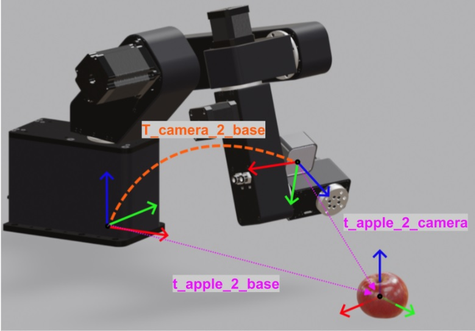 | 
|:--:| 
| *The position of the detected object with respect to the base (or world) can be obtained by knowing its position in the camera frame and knowing the transformation of the camera frame with respect to the base frame* |

In order to find the ```T_camera_2_base``` transformation matrix note where the camera frame stands in the frame hierarchies of the robot. Let’s recall this hierarchy using the figure below.

| | 
|:--:| 
| *Hierarchy of frames for the Dorna TA robotic arm* |

For now, we consider the “World” frame and the “Base” frame to be the same frames. The J0, J1, J2, … frames, are frames attached to the robot's arms, the J0 frame is the first frame that is affected by changing the J0 value, and J1 frame is the first frame affected by changing the J1 value, and so on. If you take a look at the robot, you can confirm that changing the last joint value J5 of the robot won’t affect the camera at all, but changing J4 does affect the camera’s pose, this makes it clear to us that the camera frame is in fact connected to the J4 frame. 

In order to find the ```T_camera_2_base``` transformation, we have to take the path starting from the base frame, that passes through J0, J1, J2, J3, and J4 frames and reaches to camera frame. We have to know how these consecutive frames transform to the next one. The combined transformation of all the first 5 axes of the robot is ```T_J4_2_base```  and its value is dependent on the robot’s joint values. So it is important to have access to and keep track of the robot’s joint values while executing vision programs.


After you determined the transformation from base to J4, ```T_J4_2_base```, you also need to know the transformation from J4 to the camera: ```T_camera_2_J4```, to accurately determine ```T_camera_2_base```. The relation between these transformations is: 

**T_camera_2_base    =    T_J4_2_base   ×   T_camera_2_J4**

Here by "×" we mean matrix multiplication, which is shortened to “matmul” in the numpy library.  As you can remember all these transformations have 4x4 matrix representations.  You can perform this matrix multiplication in Python like this:

```python
import numpy as np

T_camera_2_base = np.matmul(T_j4_2_base, T_camera_2_J4)
```
The ```T_J4_2_base``` can be achieved using the forward kinematics methods of the Dorna Python API as shown below.

```python
from dorna2 import Dorna, Kinematic

#Initialization of robot and kinematic modules
model = "dorna_ta"
kinematic = Kinematic(model) 
robot = Dorna()

#Accessing joint values
joint = robot.get_all_joint()

#Using forward kinematic methods
T_j4_2_base = kinematic.Ti_r_world(i=5, joint=joint[0:6])
T_camera_2_base = np.matmul(T_j4_2_base, T_camera_2_J4)
```

Lastly ```T_camera_2_J4``` can be obtained using camera calibration methods, for example by taking pictures of an Aruco marker from different poses.
Here is the link for calibration.
After calibrating this matrix, it won’t change unless you manipulate the camera setup. Since the Dorna TA you are using for this course has an already installed camera system you don’t need to perform this calibration, and the matrix is given to you. Refer to the file “dorna_vision/example/camera_robot_calibration” if you are interested in the details of the calibration process.


Now consider that you’ve obtained the ```T_camera_2_base``` matrix and you intend to use it for transforming a pose from the camera frame to the base frame to use it for creating motion commands. Two scenarios come to mind here:

### **Transforming 3D position**
Consider that you’ve acquired the 3D position of your object in the camera frame using detection. This can be extracted from the returning values of the detection API, using either the key “xyz” or ```tvec```. Each of these keys returns the 3D vector in an array format like: ```[10.1, 15.3, 230.2]```.

This 3-dimensional vector is in fact a 1x3 matrix (1 row and 3 columns), And before doing anything we should transform it to the 4x1 format so that we can act 4x4 matrix upon it:

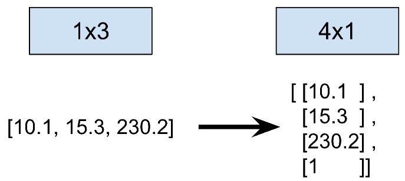 

As you can see in the figure above, the horizontal representation of the matrix is transformed into a vertical representation, and a new row with the value “1” has been added to it. Adding this value is necessary for performing calculations accurate calculations.

Let’s code this step, considering we call the translation vector ```t_object_2_camera```, and its value is obtained from the ```retval``` result of the detection algorithm.

```python
#check if the detection algorithm has detected anything
if len(retval)>0:
	#access the first detected pattern's position
	t_object_2_camera = np.array(retval[0]["xyz"])
	#reshape the vector to 4x1 and add a row with 1 to the end
	t_object_2_camera = np.vstack((np.reshape(t_object_2_camera, (3,1) ), np.array([[1]]) ))
```

 Here ```t_object_2_camera```  has been created with the desired format. Now in order to transform this vector from the camera frame to the base frame we use the matrix ```T_camera_2_base```  as below.

 ```python
t_object_2_base = np.matmul(T_camera_2_base, t_object_2_camera) 
```
The resulting vector has again a 4x1 format and has a ``1`` at its last row. You can transform it back to 1x3 format if you wish. 

### **Transforming 6D pose**
The problem is similar to the last case, but now we wish to transform the rotation of the detected object as well as its translation. You can remember that the output format of the detection algorithm for 6D pose is two vectors ```tvec``` (translation vector) and ```rvec``` (axis-angle rotation vector). We can use the ```cv2.Rodrigues(rvec)``` method to create the 3x3 rotation matrix from the rotation vector (or vice versa). Then we can append the ```tvec``` components to this 3x3 matrix to form the full 4x4 matrix of the ```T_object_2_camera```. Let’s define a function that does all of this for us:

```python
def create_transformation_matrix(rvec, tvec):
    # Convert the rotation vector to a 3x3 rotation matrix
    rotation_matrix, _ = cv2.Rodrigues(rvec)
    
    # Create a 4x4 identity matrix
    transformation_matrix = np.eye(4)
    
    # Insert the rotation matrix into the 4x4 transformation matrix
    transformation_matrix[:3, :3] = rotation_matrix
    
    # Insert the translation vector into the 4x4 transformation matrix
    transformation_matrix[:3, 3] = tvec.squeeze()
    
    return transformation_matrix
```

Let’s access the ```tvec``` and ```rvec``` of the first detected object with the same method we accessed the “xyz” before:

```python
if len(retval)>0:
	tvec = np.array(retval[0]["tvec"])
	rvec = np.array(retval[0]["rvec"])
```
Now we can create the object's transformation matrix (with respect to the camera) and transform it into the base frame using the simple matrix multiplication method explained earlier:

```python
#Create the 4x4 matrix of the object respect to camera
T_object_2_camera = create_transformation_matrix(rvec, tvec)

#Find the matrix of object respect to base
T_object_2_base = np.matmul(T_camera_2_base, T_object_2_camera)
```
Now that the program has calculated ```T_object_2_base``` matrix, we can extract its rotation and translation parts if needed.

---
## **Vision Loop**
Vision systems, whether based on classical methods or AI, function as input systems. As previously discussed, it's possible to implement blocking or non-blocking waits for vision input events. However, keep in mind that vision detection algorithms are typically CPU-intensive, meaning their inputs cannot be accessed as quickly as those from other input systems.

We can categorize the usual use cases of vision systems in industrial settings in these categories:

### **Blocking**
Sometimes you need to totally block the robot program, waiting to detect something. This event could be for example: the “detection of a red cube on a conveyor belt”. These are very common applications in the field of industrial robotics. The workflow can be simply like this:
|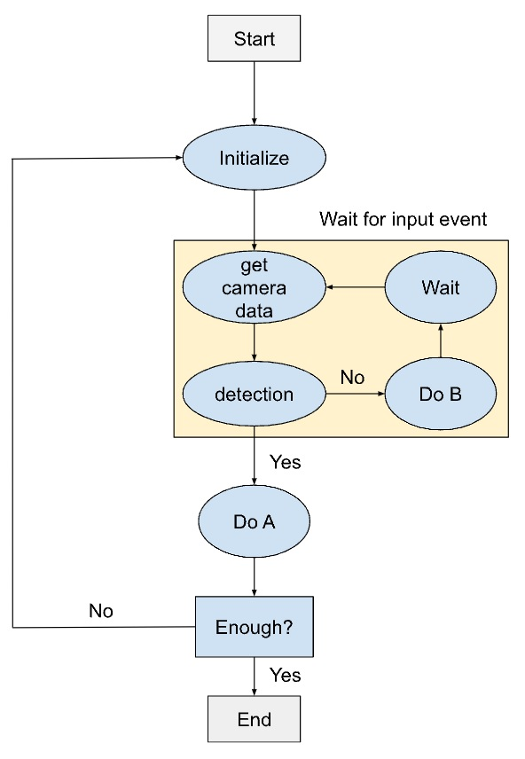 | 
|:--:| 
| *Blocking vision loop diagram* |

This loop totally blocks all other robot tasks by waiting for something to be detected, when the detection is done, the robot will do something, and afterward, it goes again to the detection waiting loop. You can implement this loop using a simple “while” loop in Python. In each loop iteration, a considerable amount of time is consumed by the detection process for example 5ms (it’s even higher for AI algorithms). But we can also force the program to wait a little bit before iterating the loop again using the method below:
```python
import time

time.sleep(0.1) #measured in seconds
```
Why this may be helpful? In many applications we are sure that things in the environment are not changing at a very fast pace, so there is no point in performing the detection algorithm 30 times a second and consuming a lot of processing power for it. For example, the conveyor speed may be low, and we are sure that we need to perform the detection algorithm only every 1.0 seconds, hence we will need to use the “sleep” (waiting) method to slow down the detection loop.

But if things are changing very fast and we need as much detection speed as we need, we can totally delete the waiting step in the loop, and let the detection algorithm execute at the highest rate possible by the processing units.

### **Non Blocking**
In chapters 3 and 4 we talked about the Dorna API’s event system, and how it could be used as a non-blocking loop for checking updates on the input values. We don’t have the same system available for the vision system, but we may need them in our applications. What if we don’t want to hold all the robots task while waiting for something to be detected? In this case, we should use multiple threads in our program. Threads run separately in parallel and won’t interrupt or hold each other. We want our main thread to perform the usual robot tasks, and we want to have an additional thread exclusively for detection. Here is a pseudocode in Python:

```python
import threading
import time

# Define the function you want to run in the separate thread
def detection_loop():
    while True:
        camera_input = get_camera_input()
        result = perform_detection(camera_input)
        if result:
        	do_something()

        time.sleep(0.5)


# Create and start the detection thread
detect_thread = threading.Thread(target=detection_loop)
detect_thread.start()

#the main thread can continue doing other things in a separate loop
while True:
    perform_normal_tasks()
```

Using the method above we can separate the detection process from the main tasks the robot performs. You only need to define your detection loop in a separate function and tell the program to run this function in a new thread. The form of the detection loop is just like what we discussed before, it can wait in each loop iteration and this wait does not block the robot program, it only slows down the detection process.

What if you want these two threads to communicate with each other? Let’s say there may be red, or blue boxes on the conveyor and we want the robot to perform different tasks when there are blue or red boxes visible. This can be done simply using a global variable. Take a look at the pseudocode below:

```python
import threading
import time

blue_box_flag = False
red_box_flag = False 

def detection_loop():
    while True:
        get_camera_input()
        result = perform_detection()
        if result:
        	if red box in result:
        		red_box_flag  = True
        	else:
        		red_box_flag = False
        	
        	if blue box in result:
        		blue_box_flag = True
        	else:
        		blue_box_flag = False

        time.sleep(0.5)


# Create and start the detection thread
detect_thread = threading.Thread(target=detection_loop)
detect_thread.start()

# Main thread can continue doing other things
while True:
    if red_box_flag:
    		do_tasks_for_red_box()
	if blue_box_flag:
		do_tasks_for_blue_box()
```