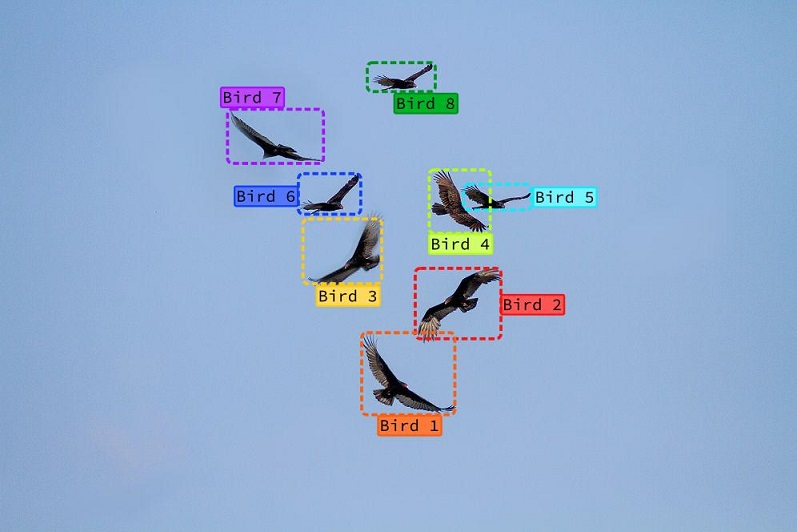
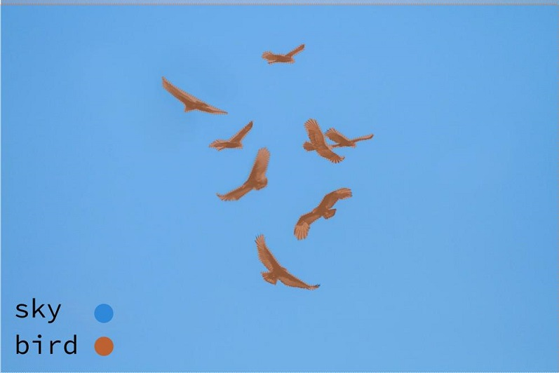
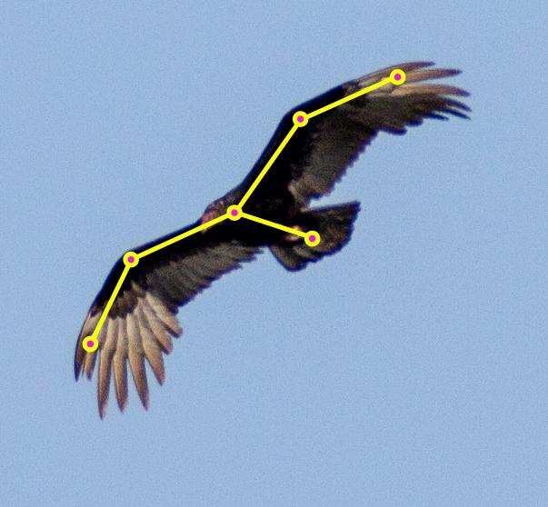

# **8. Robot Vision with AI **

In modern industrial automation, integrating AI vision into robotic arm systems has become essential for enhancing operational efficiency and precision. This chapter provides a practical guide on using AI vision, particularly YOLO, to enhance the capabilities of industrial robotic arm systems.

Traditional computer vision methods, such as those provided in the previous chapter, have been instrumental in developing early robotic arm systems. These methods typically involve feature extraction techniques like edge detection and template matching, which require extensive manual tuning and are often limited by varying environmental conditions. However, with the advent of AI vision, we can now harness the power of deep learning models to achieve superior performance in object detection and recognition.
AI vision, offers several advantages over traditional methods, unlike traditional methods, which may struggle with variations in lighting and occlusion, the deep learning approach allows it to adapt to diverse environments and object appearances. The end-to-end nature of AI vision models reduces the need for manual intervention, streamlining the detection and recognition process.

YOLO, which stands for "You Only Look Once," is a state-of-the-art object detection system that revolutionizes the way objects are detected and classified in images. Unlike traditional methods that apply a classifier to multiple regions of an image, YOLO applies a single neural network to the entire image. This network divides the image into a grid and simultaneously predicts bounding boxes and class probabilities for each grid cell. This approach allows YOLO to achieve speed and accuracy, making it particularly well-suited for real-time applications, such as in industrial robotics, where speed and accuracy matter. YOLO's ability to process images in real-time—often at a high rate of frames per second—enables robotic arms to respond instantaneously to changes in their environment. This responsiveness is essential for tasks such as quality control, sorting, and assembly, where quick and accurate decision-making can significantly enhance productivity and reduce errors. 

As we delve deeper into this chapter, we will explore detailed implementation steps, best practices, and case studies that demonstrate the potential of AI vision in industrial robotic arm systems. 

---
## **How AI Works**
AI vision, particularly through the use of deep learning, represents a significant advancement over classical pattern detection techniques. At its core, AI vision relies on artificial neural networks, specifically convolutional neural networks (CNNs), to learn and extract features from images. The process begins with feeding raw image data into the neural network, which consists of multiple layers, each designed to perform specific operations such as convolution, activation, pooling, and fully connected layers.

Training the network involves feeding it a large dataset of labeled images and using backpropagation to adjust the weights of the filters and neurons, minimizing the difference between the predicted and actual labels. This training process enables the network to learn hierarchical feature representations, starting from simple edges to more complex structures and ultimately to specific objects. Ready-to-use libraries such as YOLO come with pre-trained neural networks, enabling developers to quickly integrate object detection capabilities into their systems without the need for extensive training or dataset preparation.

AI vision excels in real-world applications due to its ability to generalize from diverse training data, making it robust to variations in lighting, orientation, and occlusion. Unlike classical pattern detection, which often requires manual feature engineering and struggles with complex scenes, AI vision systems can automatically adapt and improve as they are exposed to more data. This adaptability and accuracy are particularly valuable in industrial settings, where conditions can vary widely and precision is crucial.

---
## **AI Vision Tasks**
Here are some of the usual tasks engineers use the AI vision systems for. Specific models have to be trained to perform each task effectively.

### **Classification**
In AI vision, classification refers to the process of identifying and categorizing an entire image into a predefined class or category. For example, a classification model trained on a dataset of animals might categorize an input image as containing a cat, dog, or bird. This is a fundamental task in computer vision that enables systems to understand what general type of object or scene an image represents.

|  | 
|:--:| 
| *Vision classification* |

### **Localization**
Localization involves not only identifying what objects are present in an image but also determining their locations within the image. This typically means drawing bounding boxes around the objects of interest. For example, in an image containing multiple objects, a localization algorithm will output the coordinates of the boxes that enclose each object, providing spatial context that mere classification does not.

|  | 
|:--:| 
| *Vision localization* |

### **Object Detection**
Object detection is a combination of both classification and localization. It involves identifying multiple objects in an image, classifying them, and then drawing bounding boxes around each one. For instance, in an image of a crowded street, object detection algorithms will identify and classify pedestrians, cars, bicycles, etc., and indicate their positions with bounding boxes. This is widely used in applications such as autonomous driving and surveillance.

|  | 
|:--:| 
| *Vision object detection* |

### **Semantic Segmentation**
Semantic segmentation goes beyond object detection by classifying each pixel in an image into a class label, effectively segmenting the image into different regions based on object categories. For example, in an image of a park, semantic segmentation will color code each pixel to indicate whether it belongs to the sky, grass, trees, or people, providing a detailed understanding of the scene's composition.
|  | 
|:--:| 
| *Vision semantic segmentation* |

### **Instance Segmentation**
Instance segmentation is a more advanced form of segmentation where the goal is to identify and delineate each object instance separately, even if they belong to the same class. For example, in a crowded scene with multiple people, instance segmentation will not only classify pixels as belonging to the "person" category but will also differentiate between different individuals, providing a separate mask for each person.
|  | 
|:--:| 
| *Vision instance segmentation* |

### **Object Tracking**
Object tracking involves following the movement of objects across a sequence of frames in a video. Once an object is detected, a tracking algorithm maintains its identity over time, updating its position as it moves through the frames. This is crucial for applications like video surveillance, sports analytics, and any scenario where understanding the motion and trajectory of objects is important.
|  | 
|:--:| 
| *Vision object tracking* |

### **Pose and Keypoint Detection**
Object pose detection aims to determine the orientation and position of an object in a three-dimensional space. This involves estimating the object's pose parameters such as rotation and translation relative to the camera. For example, in augmented reality or robotics, knowing the exact pose of an object allows for more precise interaction with the environment, enabling tasks like grasping or placing objects accurately.
|  | 
|:--:| 
| *Vision Pose Detection* |