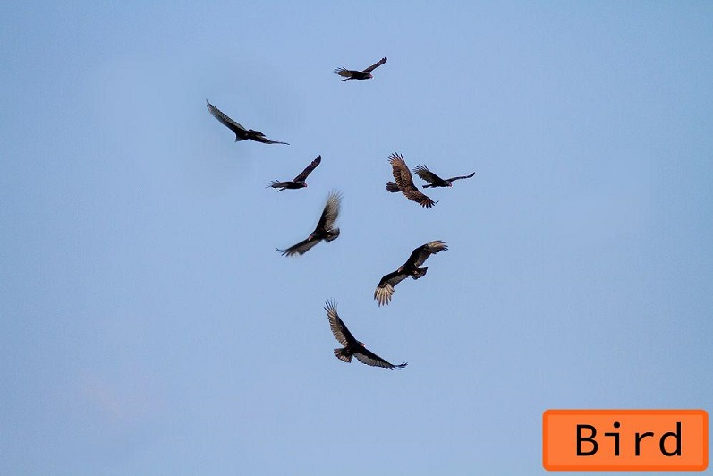
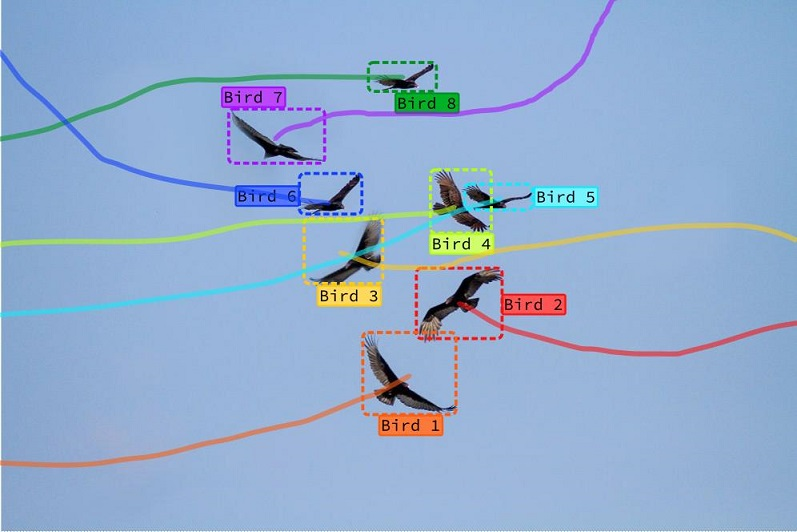
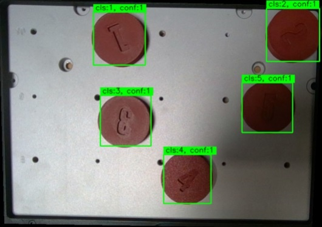

# **8. Robot Vision with AI**

In modern industrial automation, integrating AI vision into robotic arm systems has become essential for enhancing operational efficiency and precision. This chapter provides a practical guide on using AI vision methods, to enhance the capabilities of industrial robotic arm systems.

Traditional computer vision methods, such as those provided in the previous chapter, have been instrumental in developing early robotic arm systems. These methods typically involve feature extraction techniques like edge detection and template matching, which require extensive manual tuning and are often limited by varying environmental conditions. However, with the advent of AI vision, we can now harness the power of deep learning models to achieve superior performance in object detection and recognition.
AI vision, offers several advantages over traditional methods, unlike conventional methods, which may struggle with variations in lighting and occlusion, the deep learning approach allows it to adapt to diverse environments and object appearances. The end-to-end nature of AI vision models reduces the need for manual intervention, streamlining the detection and recognition process.

As we explore this chapter further, we will explore detailed implementation steps, best practices, and case studies that demonstrate the potential of AI vision in industrial robotic arm systems. 

---
## **How AI Works**
AI vision, particularly through deep learning, represents a significant advancement over classical pattern detection techniques. At its core, AI vision relies on artificial neural networks, specifically convolutional neural networks (CNNs), to learn and extract features from images. The process begins with feeding raw image data into the neural network, which consists of multiple layers, each designed to perform specific operations such as convolution, activation, pooling, and fully connected layers.

Training the network involves feeding it a large dataset of labeled images and using backpropagation to adjust the weights of the filters and neurons, minimizing the difference between the predicted and actual labels. This training process enables the network to learn hierarchical feature representations, starting from simple edges to more complex structures and ultimately to specific objects. Ready-to-use AI vision libraries come with pre-trained neural networks, enabling developers to quickly integrate object detection capabilities into their systems without the need for extensive training or dataset preparation.

AI vision excels in real-world applications due to its ability to generalize from diverse training data, making it robust to variations in lighting, orientation, and occlusion. Unlike classical pattern detection, which often requires manual feature engineering and struggles with complex scenes, AI vision systems can automatically adapt and improve as they are exposed to more data. This adaptability and accuracy are particularly valuable in industrial settings, where conditions can vary widely and precision is crucial.

---
## **AI Vision Tasks**
Here are some of the usual tasks engineers use the AI vision systems for. Specific models have to be trained to perform each task effectively.

### **Classification**
In AI vision, classification refers to the process of identifying and categorizing an entire image into a predefined class or category. For example, a classification model trained on a dataset of animals might categorize an input image as containing a cat, dog, or bird. This is a fundamental task in computer vision that enables systems to understand what general type of object or scene an image represents.

|  | 
|:--:| 
| *Vision classification* |

### **Localization**
Localization involves not only identifying what objects are present in an image but also determining their locations within the image. This typically means drawing bounding boxes around the objects of interest. For example, in an image containing multiple objects, a localization algorithm will output the coordinates of the boxes that enclose each object, providing spatial context that mere classification does not.

|  | 
|:--:| 
| *Vision localization* |

### **Object Detection**
Object detection is a combination of both classification and localization. It involves identifying multiple objects in an image, classifying them, and then drawing bounding boxes around each one. For instance, in an image of a crowded street, object detection algorithms will identify and classify pedestrians, cars, bicycles, etc., and indicate their positions with bounding boxes. This is widely used in applications such as autonomous driving and surveillance.

|  | 
|:--:| 
| *Vision object detection* |

### **Semantic Segmentation**
Semantic segmentation goes beyond object detection by classifying each pixel in an image into a class label, effectively segmenting the image into different regions based on object categories. For example, in an image of a park, semantic segmentation will color code each pixel to indicate whether it belongs to the sky, grass, trees, or people, providing a detailed understanding of the scene's composition.
|  | 
|:--:| 
| *Vision semantic segmentation* |

### **Instance Segmentation**
Instance segmentation is a more advanced form of segmentation where the goal is to identify and delineate each object instance separately, even if they belong to the same class. For example, in a crowded scene with multiple people, instance segmentation will not only classify pixels as belonging to the "person" category but will also differentiate between different individuals, providing a separate mask for each person.
|  | 
|:--:| 
| *Vision instance segmentation* |

### **Object Tracking**
Object tracking involves following the movement of objects across a sequence of frames in a video. Once an object is detected, a tracking algorithm maintains its identity over time, updating its position as it moves through the frames. This is crucial for applications like video surveillance, sports analytics, and any scenario where understanding the motion and trajectory of objects is important.
|  | 
|:--:| 
| *Vision object tracking* |

### **Pose and Keypoint Detection**
Object pose detection aims to determine the orientation and position of an object in a three-dimensional space. This involves estimating the object's pose parameters such as rotation and translation relative to the camera. For example, in augmented reality or robotics, knowing the exact pose of an object allows for more precise interaction with the environment, enabling tasks like grasping or placing objects accurately.
|  | 
|:--:| 
| *Vision Pose Detection* |

---
## **AI Vision Workflow**
Next up in this chapter, we will explore the AI detection workflow to perform a simple object detection application that is similar to many of the object detection applications in industrial settings. Our detection program uses pre-trained libraries (such as **yolo** family of libraries) as its base AI detection engine, and we will learn intuitive tools such as **Roboflow** for preparing training data. We will learn to train the neural network with the data specifically prepared for our task, and we will use the trained model locally on the robot system for real-time detection.

### **Training Process**
A pre-trained vision model is capable of detecting a few common objects and is not pre-trained for detecting all sorts of complex objects we may need in our real-world scenarios. We can train/fine-tune the model to enhance it for the detection of our desired classes of objects. This extra step of training that goes on top of the model’s original training is much less time-consuming and needs a lot less amount of data, since the base model is already capable of detecting many features in the images, e.g. edges, geometrical features, textures, and so on, and it can easily learn to recognize new categories of objects quickly.

In this section, you will learn to prepare the data and execute the training for a simple object detection task.

#### **Preparing Data**
The essence of machine learning is to train a machine to perform a desired task using sample data, enabling it to perform well on any given data. The more data you provide for training, the better the algorithm becomes at the task.

In the case of the detection algorithm, we should prepare the sample data specifically for detection. You can expect the algorithm to perform well at conditions similar to what you’ve shown to it, so it is wise to choose the sample data, as close as possible to the real setting, but as general as possible so the algorithm handles new conditions well. Of course, it is time-consuming to collect data, so you have to be wise and keep your dataset general and small at the same time. So we can summarize some of the tips for collecting better data for detection:

- Match the Environment: Capture training data in the same environment where the detection will be performed. Consistency in surroundings ensures better results.

- Use the Same Camera: Train the model using images from the same camera that will be used during detection. For instance, training on high-resolution images won't yield good results if the source is a low-resolution camera.

- Maintain Object pose: Ensure the object's dimensions and orientations in the training data closely match those during detection. This alignment improves the model's accuracy.

- Consistent Lighting: Match the lighting conditions in the training data to those of the detection environment. For example, training with images in morning light but expecting good performance under night lighting won't work well. If you need robustness across varied lighting conditions, include data from both scenarios in your training set.

- Increase Data Variety: Incorporating diverse conditions into your dataset enhances the model's adaptability and robustness to environmental changes.
    

<h3 style="margin-top: 0;">Note</h3>
Regarding the points mentioned above, it would be a wise choice to use the Dorna robot's vision system for collecting data as well. After preparing the environment and the robot and camera in position, you can use the detection GUI (introduced in the previous chapter) by selecting the option "No detection" as your detection method and enabling "Save the annotated image" to save the captured image. After that, the detection GUI can be used as a tool for capturing and saving images. 

#### **Data Annotation and Training**
Training a vision system (or almost any machine learning model) is similar to teaching a child. You demonstrate a task a few times, and they learn by observing and mimicking your actions. In this context, we "teach" the model by showing it how to detect a specific object using the sample image data we've prepared. The model learns to identify and detect that object by analyzing these examples, just as a child learns by watching and imitating.

Once your image dataset is ready, the next step is to annotate the objects in each image. Annotation involves marking and labeling the objects of interest, which helps the model learn what to detect.

There are several tools available to simplify this process. We recommend using [Roboflow](https://roboflow.com/), a user-friendly and free-to-use platform that offers a comprehensive set of tools for efficient annotation. It can help you with many possible vision tasks.

|  | 
|:--:| 
| *Vision tasks Roboflow can help you with* |

You can follow the in this chapter [chapter](https://github.com/dorna-robotics/education/tree/main/Supplementary%2005%20-%20ML%20yolov4%20Train)
 to prepare the data on Roboflow and to train the model. 

 |  | 
|:--:| 
| *Sample annotated data. As you can see here, the data contains different classes (each class has a different color for annotation), different lighting conditions, and different orientations, all help the model to be more robust and perform well in all scenarios.* |
 
 After the data annotation is done, the data is ready for training. In machine learning, data is typically divided into three distinct sets: training, validation, and test data. Each set serves a specific purpose in the model development process:

- **Training Data**: It is used to train the machine learning model. The model learns patterns, relationships, and features from this data. During training, the model adjusts its parameters (weights) based on the input data and the corresponding output labels. This set is usually the largest because the model needs a substantial amount of data to learn effectively.
  
- **Validation Data**: It is used to tune the model and validate its performance during training. Helps in the selection of model hyperparameters (e.g., learning rate, number of layers) and in preventing overfitting. Typically smaller than the training set but still significant enough to provide reliable feedback.
  
- **Test Data**: It is used to evaluate the final performance of the trained model and has no role in the training process. It provides an unbiased assessment of how well the model generalizes to new, unseen data. Similar to or slightly smaller than the validation set.

As Roboflow recommends, a 70%, 20%, 10% (train, valid, test) splitting ratio is good enough for us.

The next step is to train a model with the prepared data. There is a Google Colab notebook specially prepared that connects to your Robotflow project, downloads the data and the annotations, performs the training on the base model, and gives the resulting model in a single packed file. You'll also learn to use it in the last chapter linked above. 

Note: Google Colab, is a free cloud-based platform that allows users to write, execute, and share Python code through a Jupyter Notebook interface. It provides a powerful environment for machine learning, data analysis, and deep learning, with seamless integration with Google Drive for easy file storage and access. Google Colab simplifies the workflow for developing and testing machine learning models, sharing projects, and collaborating with others in real time.

#### **Testing the Model**
Using the Google Colab you can download the trained model to use it locally on any device. The file contains all the training information or weights. You can use the detection GUI introduced to you in the previous chapter to set up a detection program using your trained model. This is how it goes: 

- When you are initializing the application, go under the "AI Model" tab, select your task (e.g. object detection), and give the application the address to your downloaded model weights.

 
|  | 
|:--:| 
| *Initialization setting* |

- After all the initialization setting is done and the image source has been specified, In the detection panel, you can find a new option added to the "Detection Method" list, in this case: "Object Detection". Select this option and the preparation is done.

- You can specify all the detection classes you want to include in your detection application, by typing all the class names (separated by commas) in the "Detection classes" input.

|  | 
|:--:| 
| *Detection result of 5 different classes named after the numbers appearing on the chips: 1, 2, 3, 4, and 5.* |

Now you can use the detection application in the same way as in the previous chapter. You can use the 6D pose option to get access to the 3D position and orientation of the detected objects, and you can use the generated "API call" code to use your detection model in a Python application.

<h3 style="margin-top: 0;">Lab Exercise 1</h3>
    
In this exercise, we want to teach the robot to detect handwritten numbers.

**Step 1**: Gather a dataset of at least 20 pictures, that contain handwritten numbers, in many different forms, from 0 to 9, but keep the size consistent and readable for the camera. Take the images using the method introduced to you in this chapter, with the help of the robot's camera and GUI's image-saving option.

**Step 2**: Create a Roboflow project, upload the images, and annotate them (object detection method). Follow the instructions given to you in the supplementary chapter to train the model.

**Step 3**: Now prepare the GUI with the downloaded weights, and use new data images (that you haven't used in the training process) to test out the model's strength).

